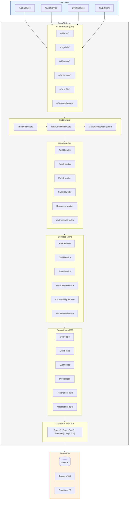

# Saga API Architecture

This document provides a high-level overview of the Saga API architecture for developers joining the project.

## Table of Contents

- [System Overview](#system-overview)
- [Directory Structure](#directory-structure)
- [Layer Responsibilities](#layer-responsibilities)
- [Authentication Flow](#authentication-flow)
- [Real-Time Updates (SSE)](#real-time-updates-sse)
- [Database Architecture](#database-architecture)
- [Configuration](#configuration)

---

## System Overview



## Directory Structure

```
api/
├── cmd/
│   └── server/
│       └── main.go              # Application entry point
├── internal/
│   ├── config/
│   │   └── config.go            # Configuration loading from env
│   ├── database/
│   │   ├── database.go          # Database interface & error types
│   │   ├── surrealdb.go         # SurrealDB implementation
│   │   └── transaction.go       # Transaction utilities (TxBuilder, AtomicBatch)
│   ├── handler/                 # HTTP handlers (26 files)
│   │   ├── auth.go              # Login, register, logout
│   │   ├── oauth.go             # Google/Apple OAuth
│   │   ├── passkey.go           # WebAuthn passkeys
│   │   ├── guild.go             # Guild management
│   │   ├── event.go             # Event CRUD
│   │   ├── discovery.go         # People/event discovery
│   │   ├── profile.go           # User profile management
│   │   ├── moderation.go        # Reports, blocks
│   │   └── ...
│   ├── middleware/              # HTTP middleware (5 files)
│   │   ├── auth.go              # JWT validation
│   │   ├── ratelimit.go         # Per-user rate limiting
│   │   ├── guild_access.go      # Guild membership checks
│   │   ├── idempotency.go       # Request deduplication
│   │   └── middleware.go        # Logging, recovery, CORS
│   ├── model/                   # Domain models (24 files)
│   │   ├── user.go              # User entity
│   │   ├── event.go             # Event entity
│   │   ├── profile.go           # User profiles, location privacy
│   │   ├── rsvp.go              # Unified RSVP (polymorphic)
│   │   ├── resonance.go         # Gamification scoring
│   │   └── ...
│   ├── repository/              # Data access (27 files)
│   │   ├── user.go              # User CRUD
│   │   ├── event.go             # Event queries
│   │   ├── helpers.go           # Shared parsing utilities
│   │   └── ...
│   ├── service/                 # Business logic (24 files)
│   │   ├── auth.go              # Auth workflows
│   │   ├── resonance.go         # Scoring calculations
│   │   ├── compatibility.go     # OkCupid-style matching
│   │   └── ...
│   ├── jobs/                    # Background jobs
│   │   └── nexus.go             # Monthly guild activity scoring
│   └── validation/              # Input validation
├── migrations/
│   ├── 001_initial_schema.surql      # Base schema (1200+ lines)
│   ├── 002_schema_hardening.surql    # Performance & safety improvements
│   ├── 003_bug_fixes.surql           # Bug fixes
│   ├── 004_security_hardening.surql  # Access control functions
│   ├── 005_performance_indexes.surql # Query optimization
│   ├── 006_data_model_cleanup.surql  # Schema refinements
│   ├── 007_features_v2.surql         # Feature additions
│   ├── 008_guild_roles.surql         # Role system
│   ├── 009_device_tokens.surql       # Push notification tokens
│   └── seed.surql                    # Development seed data
├── openapi/                     # API specification
│   ├── openapi.yaml             # Main spec
│   └── paths/                   # Endpoint definitions
└── pkg/
    └── jwt/                     # JWT utilities
```

## Layer Responsibilities

### Handlers (`internal/handler/`)
- Parse HTTP requests
- Validate input (using model validation methods)
- Call service layer
- Format HTTP responses
- Handle errors appropriately

**Example flow:**
```go
func (h *EventHandler) CreateEvent(w http.ResponseWriter, r *http.Request) {
    // 1. Parse request body
    var req model.CreateEventRequest
    if err := DecodeJSON(r, &req); err != nil {
        WriteError(w, model.NewBadRequestError("invalid request body"))
        return
    }

    // 2. Validate
    if errors := req.Validate(); len(errors) > 0 {
        WriteError(w, model.NewValidationError(errors))
        return
    }

    // 3. Get user from context (set by auth middleware)
    userID := middleware.GetUserID(r.Context())

    // 4. Call service
    event, err := h.eventService.Create(r.Context(), userID, &req)
    if err != nil {
        WriteError(w, MapServiceError(err, "failed to create event"))
        return
    }

    // 5. Respond
    WriteData(w, http.StatusCreated, event, nil)
}
```

### Services (`internal/service/`)
- Implement business logic
- Orchestrate multiple repositories
- Enforce business rules
- Handle transactions for multi-step operations

**Example - Resonance scoring:**
```go
func (s *ResonanceService) AwardQuesting(ctx context.Context, userID, eventID string) error {
    // 1. Check if already awarded (idempotent)
    if s.repo.HasAwarded(ctx, userID, "questing", eventID) {
        return nil  // Already awarded, skip
    }

    // 2. Validate event completion
    event, err := s.eventRepo.GetByID(ctx, eventID)
    if !event.CompletionVerified {
        return ErrEventNotVerified
    }

    // 3. Calculate points (varies by event type)
    points := s.calculateQuestingPoints(event)

    // 4. Award atomically (ledger + score update)
    return s.repo.AwardPointsAtomic(ctx, &model.ResonanceLedgerEntry{
        User:           userID,
        Stat:           model.ResonanceStatQuesting,
        Points:         points,
        SourceObjectID: eventID,
        Reason:         model.ReasonEventCompleted,
    })
}
```

### Repositories (`internal/repository/`)
- Execute database queries
- Parse SurrealDB responses
- Handle error mapping
- Provide CRUD operations

**Key pattern - Result parsing:**
```go
func (r *UserRepository) GetByID(ctx context.Context, id string) (*model.User, error) {
    query := `SELECT * FROM <record> $id`
    result, err := r.db.QueryOne(ctx, query, map[string]interface{}{"id": id})
    if err != nil {
        if errors.Is(err, database.ErrNotFound) {
            return nil, nil  // Not found is not an error
        }
        return nil, err
    }
    return parseUserResult(result)  // Complex parsing needed
}
```

### Database Layer (`internal/database/`)
- Abstract SurrealDB specifics
- Provide transaction support
- Handle connection management
- Define standard error types

See [DATABASE.md](./DATABASE.md) for detailed documentation.

## Authentication Flow


### Supported Authentication Methods

1. **Email/Password** - Traditional login with bcrypt-hashed passwords
2. **Passkey (WebAuthn)** - Passwordless authentication with platform authenticators
3. **OAuth 2.0** - Google and Apple sign-in with federated identity

## Real-Time Updates (SSE)

The API uses Server-Sent Events for real-time updates:

```
┌──────────┐                    ┌──────────┐
│  Client  │                    │   API    │
└────┬─────┘                    └────┬─────┘
     │                               │
     │  GET /v1/stream               │
     │  Authorization: Bearer <jwt>  │
     │──────────────────────────────>│
     │                               │
     │  Content-Type: text/event-stream
     │<──────────────────────────────│
     │                               │
     │  (connection kept open)       │
     │                               │
     │  event: guild.member_joined   │
     │  data: {"guild_id": "...",    │
     │         "user_id": "..."}     │
     │<──────────────────────────────│
     │                               │
     │  event: heartbeat             │
     │  data: {}                     │
     │<──────────────────────────────│
     │                               │
```

### Event Types

| Event Type | Payload | Trigger |
|------------|---------|---------|
| `guild.member_joined` | Guild ID, user info | Member joins guild |
| `guild.member_left` | Guild ID, user ID | Member leaves guild |
| `heartbeat` | Empty | 30-second keepalive |
| `nudge` | Nudge details | Background job |

## Database Architecture

Saga uses **SurrealDB**, a multi-model database supporting:
- **Document storage** - Flexible JSON schemas
- **Relations** - Graph-like relationships (`RELATE a->b->c`)
- **Events** - Database-level triggers for automation
- **Functions** - Custom stored procedures

### Key Architectural Decisions

1. **Batch-based transactions** - SurrealDB transactions batch queries, not connection-level isolation. See [DATABASE.md](./DATABASE.md).

2. **Triggers for automation** - 106 triggers handle:
   - Validation constraints (limits, enums)
   - Timestamp auto-updates
   - Denormalized count maintenance
   - Visibility cascade enforcement

3. **Functions for privacy** - Location privacy enforced at DB level:
   - `fn::distance_bucket()` - Never exposes exact distances
   - `fn::safe_profile()` - Returns privacy-respecting profile view

4. **Polymorphic RSVP** - Single `unified_rsvp` table handles events, adventures, hangouts via `target_type` field.

## Configuration

Environment variables (see `.env.example`):

| Variable | Description | Default |
|----------|-------------|---------|
| `PORT` | Server port | 8080 |
| `DB_HOST` | SurrealDB host | localhost |
| `DB_PORT` | SurrealDB port | 8000 |
| `DB_NAMESPACE` | SurrealDB namespace | saga |
| `DB_DATABASE` | SurrealDB database | main |
| `DB_USER` | SurrealDB username | - |
| `DB_PASSWORD` | SurrealDB password | - |
| `JWT_PRIVATE_KEY_PATH` | Path to JWT signing key | - |
| `JWT_PUBLIC_KEY_PATH` | Path to JWT public key | - |
| `JWT_EXPIRATION_MINS` | Access token TTL in minutes | 15 |
| `JWT_ISSUER` | JWT issuer claim | saga |

## Next Steps

- [DATABASE.md](./DATABASE.md) - Database layer and transaction patterns
- [SCHEMA.md](./SCHEMA.md) - Schema reference with triggers and functions
- [FEATURES.md](./FEATURES.md) - How schema enables product features
- [PERFORMANCE.md](./PERFORMANCE.md) - Performance tuning guide
