# Feature Enablement Guide

This document explains how the database schema enables specific product features in Saga.

## Table of Contents

- [Discovery System](#discovery-system)
- [Location Privacy](#location-privacy)
- [Resonance Scoring](#resonance-scoring)
- [Event Completion Verification](#event-completion-verification)
- [Matching Pools](#matching-pools)
- [Visibility Cascade](#visibility-cascade)
- [Moderation System](#moderation-system)
- [Compatibility Matching](#compatibility-matching)
- [Trust Rating System](#trust-rating-system)
- [Role Catalogs](#role-catalogs)
- [Adventure Decoupling](#adventure-decoupling)
- [Voting System](#voting-system)

---

## Discovery System

The discovery system allows users to find people, events, and guilds while enforcing daily limits and eligibility requirements.

### Eligibility Requirements

Before a user can appear in discovery or discover others:

1. **Must answer 3+ questions** (tracked in `user_profile.question_count`)
2. **Must answer from all 4 required categories:**
   - Values
   - Social
   - Lifestyle
   - Communication

**Schema enforcement:**

```sql
-- Trigger: answer_eligibility_check (on answer CREATE)
-- Checks if user now has all required categories

LET $categories = (SELECT DISTINCT question.category FROM answer WHERE user = $user_id);
LET $required = fn::required_categories();  -- ["values", "social", "lifestyle", "communication"]

IF array::len(array::intersect($categories, $required)) = 4 THEN {
    UPDATE user_profile SET discovery_eligible = true WHERE user = $user_id;
};
```

**API usage:**

```go
// Check eligibility before discovery
profile, _ := profileRepo.GetByUserID(ctx, userID)
if !profile.DiscoveryEligible {
    return ErrNotEligibleForDiscovery
}
```

### Daily Limits

Users are limited to 5-10 discovery results per day to encourage meaningful connections.

**Schema:**
```sql
DEFINE TABLE discovery_daily_count SCHEMAFULL;
DEFINE FIELD user_id ON discovery_daily_count TYPE record<user>;
DEFINE FIELD date ON discovery_daily_count TYPE string;  -- YYYY-MM-DD
DEFINE FIELD people_shown ON discovery_daily_count TYPE int DEFAULT 0;
DEFINE FIELD events_shown ON discovery_daily_count TYPE int DEFAULT 0;
DEFINE FIELD guilds_shown ON discovery_daily_count TYPE int DEFAULT 0;
```

**API pattern:**

```go
func (h *DiscoveryHandler) DiscoverPeople(w http.ResponseWriter, r *http.Request) {
    userID := middleware.GetUserID(r.Context())

    // Check quota
    hasQuota, _ := h.discoveryRepo.HasQuota(ctx, userID, "people", 10)
    if !hasQuota {
        respondError(w, http.StatusTooManyRequests, "Daily discovery limit reached")
        return
    }

    // Get results
    people := h.discoveryService.DiscoverPeople(ctx, userID, limit)

    // Increment count
    h.discoveryRepo.IncrementCount(ctx, userID, "people", len(people))

    respondJSON(w, http.StatusOK, people)
}
```

---

## Location Privacy

Saga NEVER exposes exact user coordinates. All location-based features use privacy-preserving distance buckets.

### Core Principle

```
❌ NEVER: "User is 1.3km away"
✅ ALWAYS: "User is ~2km away"
```

### Schema Enforcement

**1. Model level (Go):**
```go
type Location struct {
    Lat          float64 `json:"-"`  // Never serialized to JSON
    Lng          float64 `json:"-"`  // Never serialized to JSON
    City         string  `json:"city"`
    Neighborhood string  `json:"neighborhood,omitempty"`
    Country      string  `json:"country"`
    Timezone     string  `json:"timezone,omitempty"`
}
```

**2. Database function level:**
```sql
-- fn::safe_profile returns distance_bucket, never raw coordinates
SELECT fn::safe_profile($profile_id, $viewer_lat, $viewer_lng)
-- Returns: { ..., distance_bucket: "~5km", ... }
```

**3. Coarse location helper:**
```sql
-- fn::coarse_location strips coordinates
SELECT fn::coarse_location($location)
-- Returns: { city, neighborhood, country, timezone } only
```

### API Implementation

```go
func (s *DiscoveryService) DiscoverPeople(ctx context.Context, viewerID string) ([]model.SafeProfile, error) {
    viewer, _ := s.profileRepo.GetByUserID(ctx, viewerID)

    // Query uses fn::safe_profile for all results
    query := `
        SELECT fn::safe_profile(id, $lat, $lng) as profile
        FROM user_profile
        WHERE discovery_eligible = true
          AND visibility IN ["guilds", "public"]
    `
    vars := map[string]interface{}{
        "lat": viewer.Location.Lat,
        "lng": viewer.Location.Lng,
    }

    // Results have distance_bucket, never raw distance
    return s.repo.QuerySafeProfiles(ctx, query, vars)
}
```

### Distance Buckets

| Distance | Bucket |
|----------|--------|
| < 1km | "nearby" |
| 1-2km | "~2km" |
| 2-5km | "~5km" |
| 5-10km | "~10km" |
| 10-20km | "~20km" |
| > 20km | ">20km" |

---

## Resonance Scoring

Resonance is Saga's gamification system, rewarding genuine community participation.

### Architecture Overview

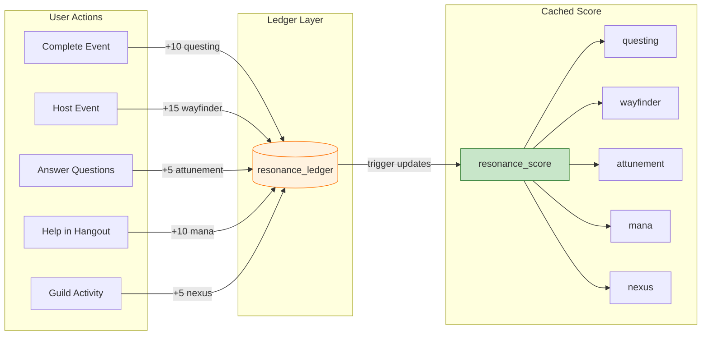

### Five Stats

| Stat | Source | Description |
|------|--------|-------------|
| **Questing** | Event completion | Completing verified events |
| **Mana** | Support sessions | Helping others in hangouts |
| **Wayfinder** | Hosting events | Organizing activities |
| **Attunement** | Profile completion | Answering questionnaire |
| **Nexus** | Guild activity | Contributing to guilds |

### Ledger-Based Architecture

Every point award creates an immutable ledger entry:

```sql
DEFINE TABLE resonance_ledger SCHEMAFULL;
DEFINE FIELD user ON resonance_ledger TYPE record<user>;
DEFINE FIELD stat ON resonance_ledger TYPE string;      -- questing, mana, etc.
DEFINE FIELD points ON resonance_ledger TYPE int;
DEFINE FIELD source_object_id ON resonance_ledger TYPE string;  -- event:abc, etc.
DEFINE FIELD reason ON resonance_ledger TYPE string;    -- Audit trail
DEFINE FIELD created_on ON resonance_ledger TYPE datetime;

-- Anti-farming: each source can only award once
DEFINE INDEX resonance_unique ON resonance_ledger
    FIELDS user, stat, source_object_id UNIQUE;
```

### Incremental Score Updates

The `resonance_score` table is updated via trigger for fast reads:

```sql
-- Trigger: resonance_score_update (on resonance_ledger CREATE)
UPDATE resonance_score SET
    total = math::max(0, total + $after.points),  -- Floor at 0
    questing = IF $after.stat = "questing" THEN
        math::max(0, questing + $after.points)
    ELSE questing END,
    -- ... other stats ...
    last_calculated = time::now()
WHERE user = $after.user;
```

### Daily Caps

```sql
DEFINE TABLE resonance_daily_cap SCHEMAFULL;
DEFINE FIELD user ON resonance_daily_cap TYPE record<user>;
DEFINE FIELD date ON resonance_daily_cap TYPE string;
DEFINE FIELD points_earned ON resonance_daily_cap TYPE int DEFAULT 0;
DEFINE FIELD cap ON resonance_daily_cap TYPE int DEFAULT 100;
```

### API Usage

```go
func (s *ResonanceService) AwardQuesting(ctx context.Context, userID, eventID string) error {
    // Check daily cap
    if !s.repo.HasDailyCap(ctx, userID) {
        return nil  // Silently skip if capped
    }

    // Idempotent award (unique constraint handles duplicates)
    awarded, err := s.repo.TryAwardPoints(ctx, &model.ResonanceLedgerEntry{
        User:           userID,
        Stat:           model.ResonanceStatQuesting,
        Points:         10,
        SourceObjectID: eventID,
        Reason:         model.ReasonEventCompleted,
    })

    if !awarded {
        return nil  // Already awarded, not an error
    }

    return nil
}
```

---

## Event Completion Verification

Events must be verified as actually happening before awarding Resonance points.

### Verification Rules

| Event Type | Requirement |
|------------|-------------|
| 1:1 Events | BOTH participants must confirm within 48h |
| Group Events | Host + at least 2 attendees must confirm within 48h |

### Schema Support

```sql
-- On event table
DEFINE FIELD confirmation_deadline ON event TYPE option<datetime>;
DEFINE FIELD confirmed_count ON event TYPE int DEFAULT 0;
DEFINE FIELD requires_confirmation ON event TYPE bool DEFAULT true;
DEFINE FIELD completion_verified ON event TYPE bool DEFAULT false;

-- On unified_rsvp table
DEFINE FIELD completion_confirmed ON unified_rsvp TYPE option<datetime>;
DEFINE FIELD early_confirmed ON unified_rsvp TYPE option<bool>;

-- Trigger: rsvp_confirmation_tracking
-- Increments event.confirmed_count when RSVP confirms
```

### Confirmation Flow

```
User confirms attendance
        │
        ▼
┌───────────────────┐
│ Update unified_rsvp│
│ completion_confirmed│
│ = time::now()      │
└─────────┬─────────┘
          │
          ▼ (trigger fires)
┌───────────────────┐
│ Increment event.  │
│ confirmed_count   │
└─────────┬─────────┘
          │
          ▼
┌───────────────────┐
│ Check fn::check_  │
│ event_completion()│
└─────────┬─────────┘
          │
    ┌─────┴─────┐
    │           │
    ▼           ▼
 false        true
              │
              ▼
┌───────────────────┐
│ Set event.       │
│ completion_verified│
│ = true            │
└───────────────────┘
```

### Bonus Points

```sql
-- Early confirmation bonus (≥2 hours before event)
fn::is_early_confirm($event_id)  -- Returns true if confirmed early

-- On-time checkin bonus (±10 minute window)
fn::is_ontime_checkin($event_id, $checkin_time)
```

---

## Matching Pools

Saga implements Donut-style random matching for guilds.

### How It Works

1. Guild creates a `matching_pool` with frequency (weekly/biweekly/monthly)
2. Members opt into `pool_member` records
3. Background job generates `match_result` records
4. Members can exclude specific people (max 20)

### Schema

```sql
DEFINE TABLE matching_pool SCHEMAFULL;
DEFINE FIELD guild_id ON matching_pool TYPE record<guild>;
DEFINE FIELD name ON matching_pool TYPE string;
DEFINE FIELD match_size ON matching_pool TYPE int DEFAULT 2;  -- 2-6 people
DEFINE FIELD frequency ON matching_pool TYPE string;  -- weekly, biweekly, monthly
DEFINE FIELD is_active ON matching_pool TYPE bool DEFAULT true;
DEFINE FIELD last_match_on ON matching_pool TYPE option<datetime>;
DEFINE FIELD next_match_on ON matching_pool TYPE option<datetime>;

DEFINE TABLE pool_member SCHEMAFULL;
DEFINE FIELD pool_id ON pool_member TYPE record<matching_pool>;
DEFINE FIELD member_id ON pool_member TYPE record<member>;
DEFINE FIELD is_active ON pool_member TYPE bool DEFAULT true;
DEFINE FIELD excluded_members ON pool_member TYPE array<record<member>> DEFAULT [];
DEFINE INDEX pool_member_unique ON pool_member FIELDS pool_id, member_id UNIQUE;

-- Constraint: max 20 exclusions
DEFINE EVENT check_exclusion_limit ON TABLE pool_member WHEN ... THEN {
    IF array::len($after.excluded_members) > 20 THEN {
        THROW "Maximum 20 exclusions allowed";
    };
};
```

### Matching Algorithm (Application Layer)

```go
func (s *PoolService) GenerateMatches(ctx context.Context, poolID string) error {
    pool, _ := s.poolRepo.GetByID(ctx, poolID)
    members, _ := s.poolRepo.GetActiveMembers(ctx, poolID)

    // Build exclusion graph
    exclusions := s.buildExclusionGraph(members)

    // Generate groups respecting exclusions
    groups := s.partitionIntoGroups(members, pool.MatchSize, exclusions)

    // Create match results
    for _, group := range groups {
        s.matchRepo.Create(ctx, &model.MatchResult{
            PoolID:    poolID,
            Round:     pool.CurrentRound + 1,
            Members:   group,
            Status:    "pending",
            CreatedOn: time.Now(),
        })
    }

    // Update pool
    return s.poolRepo.UpdateNextMatch(ctx, poolID)
}
```

---

## Visibility Cascade

Child entities cannot be more visible than their parents.

### Hierarchy

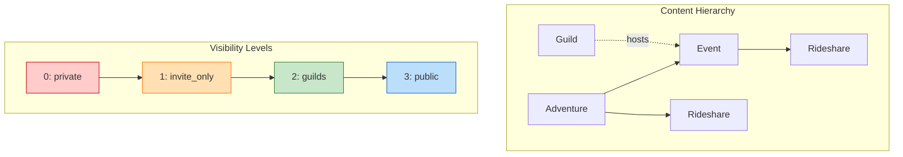

**Rule:** Child visibility level must be ≤ parent visibility level.

### Visibility Levels

| Level | Name | Audience |
|-------|------|----------|
| 0 | private | Only organizers |
| 1 | invite_only | Invited users only |
| 2 | guilds | Guild members |
| 3 | public | Everyone |

### Enforcement

```sql
-- Trigger: visibility_cascade_event
DEFINE EVENT visibility_cascade_event ON TABLE event
    WHEN $event = "CREATE" OR $event = "UPDATE" THEN {

    IF $after.adventure_id != NONE THEN {
        LET $parent_vis = (SELECT visibility FROM adventure WHERE id = $after.adventure_id)[0].visibility;
        LET $parent_level = fn::visibility_level($parent_vis);
        LET $child_level = fn::visibility_level($after.visibility);

        IF $child_level > $parent_level THEN {
            THROW "Event visibility cannot exceed parent adventure visibility";
        };
    };
};
```

### Valid Combinations

| Adventure | Event | Rideshare | Valid? |
|-----------|-------|-----------|--------|
| guilds | guilds | guilds | Yes |
| guilds | private | private | Yes |
| guilds | public | - | NO |
| public | public | public | Yes |
| private | private | private | Yes |
| private | guilds | - | NO |

---

## Moderation System

Saga implements a three-layer moderation system.

### Layer 1: User Flags

Quick way for users to flag concerning content:

```sql
DEFINE TABLE user_flag SCHEMAFULL;
DEFINE FIELD reporting_user ON user_flag TYPE record<user>;
DEFINE FIELD reported_user ON user_flag TYPE record<user>;
DEFINE FIELD category ON user_flag TYPE string;
DEFINE FIELD status ON user_flag TYPE string DEFAULT "pending";
```

### Layer 2: Detailed Reports

Full reports with content tracking:

```sql
DEFINE TABLE report SCHEMAFULL;
DEFINE FIELD reporter_user_id ON report TYPE record<user>;
DEFINE FIELD reported_user_id ON report TYPE record<user>;
DEFINE FIELD category ON report TYPE string
    ASSERT $value IN ["spam", "harassment", "hate_speech", "inappropriate_content", "made_uncomfortable", "other"];
DEFINE FIELD content_type ON report TYPE option<string>;  -- "event", "forum_post", etc.
DEFINE FIELD content_id ON report TYPE option<string>;
DEFINE FIELD status ON report TYPE string DEFAULT "pending"
    ASSERT $value IN ["pending", "reviewed", "resolved", "dismissed"];
```

### Layer 3: Moderation Actions

Actions taken against users:

```sql
DEFINE TABLE moderation_action SCHEMAFULL;
DEFINE FIELD user_id ON moderation_action TYPE record<user>;
DEFINE FIELD level ON moderation_action TYPE string
    ASSERT $value IN ["nudge", "warning", "suspension", "ban"];
DEFINE FIELD duration_days ON moderation_action TYPE option<int>;
DEFINE FIELD expires_on ON moderation_action TYPE option<datetime>;
DEFINE FIELD is_active ON moderation_action TYPE bool DEFAULT true;
```

### Blocking

```sql
DEFINE TABLE block SCHEMAFULL;
DEFINE FIELD blocker_user_id ON block TYPE record<user>;
DEFINE FIELD blocked_user_id ON block TYPE record<user>;
DEFINE INDEX idx_block_pair ON block FIELDS blocker_user_id, blocked_user_id UNIQUE;

-- Self-block prevention
DEFINE EVENT block_self_check ON TABLE block WHEN $event = "CREATE" THEN {
    IF $after.blocker_user_id = $after.blocked_user_id THEN {
        THROW "Cannot block yourself";
    };
};
```

### Guild-Level Policies

```sql
DEFINE TABLE guild_moderation_settings SCHEMAFULL;
DEFINE FIELD guild_id ON guild_moderation_settings TYPE record<guild>;
DEFINE FIELD require_approval_to_join ON guild_moderation_settings TYPE bool DEFAULT true;
DEFINE FIELD min_reputation_to_join ON guild_moderation_settings TYPE option<int>;
DEFINE FIELD allow_public_events ON guild_moderation_settings TYPE bool DEFAULT false;
```

---

## Compatibility Matching

Saga uses an OkCupid-style weighted compatibility algorithm.

### Question System

```sql
DEFINE TABLE question SCHEMAFULL;
DEFINE FIELD text ON question TYPE string;
DEFINE FIELD category ON question TYPE string;  -- values, social, lifestyle, communication
DEFINE FIELD options ON question TYPE array<object>;  -- [{value, label, implicit_bias}]
DEFINE FIELD is_active ON question TYPE bool DEFAULT true;

DEFINE TABLE answer SCHEMAFULL;
DEFINE FIELD user ON answer TYPE record<user>;
DEFINE FIELD question ON answer TYPE record<question>;
DEFINE FIELD selected_option ON answer TYPE string;
DEFINE FIELD importance ON answer TYPE string;  -- irrelevant, somewhat, very
DEFINE FIELD is_dealbreaker ON answer TYPE bool DEFAULT false;
DEFINE FIELD acceptable_answers ON answer TYPE array<string>;  -- Options user accepts in others
```

### Compatibility Calculation (Service Layer)

```go
func (s *CompatibilityService) Calculate(ctx context.Context, userA, userB string) (float64, error) {
    answersA, _ := s.answerRepo.GetByUserID(ctx, userA)
    answersB, _ := s.answerRepo.GetByUserID(ctx, userB)

    // Build answer maps by question
    mapA := buildAnswerMap(answersA)
    mapB := buildAnswerMap(answersB)

    var totalWeight, matchScore float64

    for questionID, answerA := range mapA {
        answerB, exists := mapB[questionID]
        if !exists {
            continue  // Only score shared questions
        }

        // Calculate weight based on importance
        weight := importanceWeight(answerA.Importance) + importanceWeight(answerB.Importance)
        totalWeight += weight

        // Check if each accepts the other's answer
        aAcceptsB := contains(answerA.AcceptableAnswers, answerB.SelectedOption)
        bAcceptsA := contains(answerB.AcceptableAnswers, answerA.SelectedOption)

        if aAcceptsB && bAcceptsA {
            matchScore += weight
        } else if answerA.IsDealbreaker || answerB.IsDealbreaker {
            // Dealbreaker violation - heavily penalize
            matchScore -= weight * 2
        }
    }

    if totalWeight == 0 {
        return 0.5, nil  // No shared questions
    }

    return math.Max(0, matchScore / totalWeight), nil
}
```

### Yikes Detection

"Yikes" options in questions trigger automatic flags:

```go
type QuestionOption struct {
    Value        string `json:"value"`
    Label        string `json:"label"`
    ImplicitBias string `json:"implicit_bias,omitempty"`  // If set, triggers bias tracking
    IsYikes      bool   `json:"is_yikes,omitempty"`       // If true, affects compatibility
}
```

When a user selects a "yikes" option, it's tracked in `unified_rsvp.yikes_count` for events requiring values alignment.

---

## Trust Rating System

Saga implements an event-anchored trust system with reviews, endorsements, and anti-abuse mechanisms.

### Trust Flow State Machine

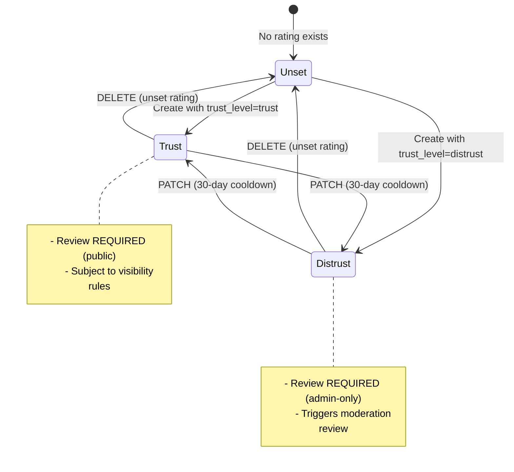

### Trust Domain ERD

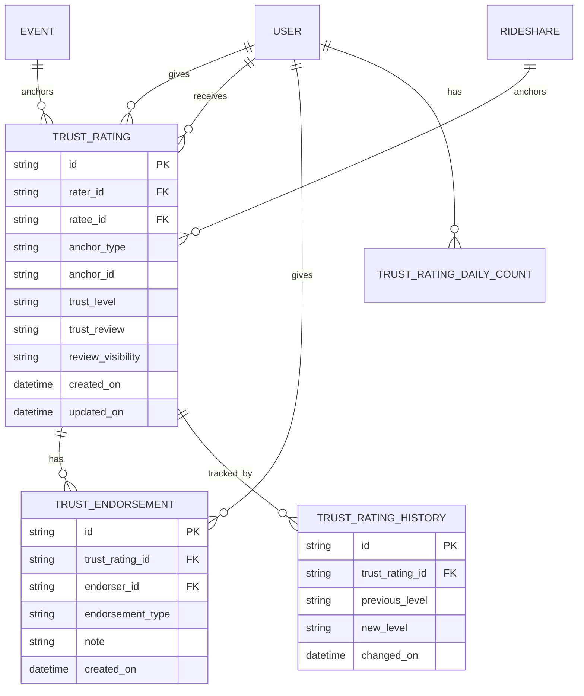

### Key Design Decisions

| Aspect | Decision | Rationale |
|--------|----------|-----------|
| Anchor Required | Event/Rideshare with verified attendance | Prevents fake reviews, ensures real interaction |
| No Neutral | Only trust/distrust, DELETE = unset | Simplifies UX, avoids "non-rating" accumulation |
| 30-day Cooldown | Can't change rating within 30 days | Prevents manipulation, encourages thoughtful ratings |
| Daily Limit | Max 10 ratings per day | Prevents spam/abuse |
| Review Required | 240 char max, always required | Forces meaningful feedback |
| Distrust Private | Distrust reviews admin-only | Protects from public shaming, enables moderation |

### Anti-Abuse Mechanisms

1. **Anchor Validation**: Both users must have confirmed attendance at the same event
2. **Rate Limiting**: 10 ratings/day/user via `trust_rating_daily_count` table
3. **Cooldown Period**: 30 days between rating changes
4. **Endorsement Limits**: One endorsement per (endorser, rating) pair
5. **Audit Trail**: All changes logged to `trust_rating_history`

---

## Role Catalogs

Reusable role templates for events and rideshares, scoped to guilds or individual users.

### Role Catalog Model

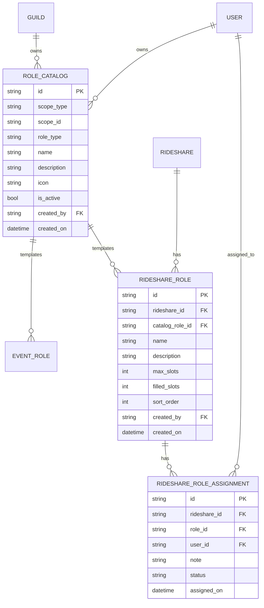

### Usage Flow

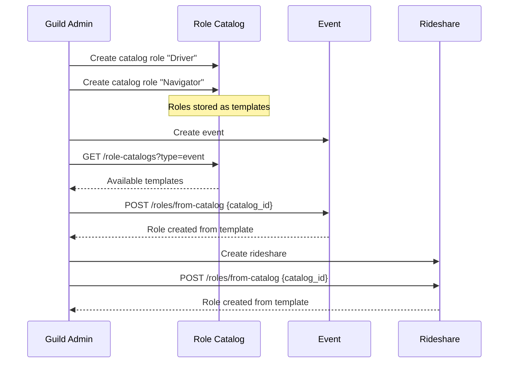

### Scope Types

| Scope | Owner | Use Case |
|-------|-------|----------|
| `guild` | Guild admins | Standard roles for guild events (Driver, Coordinator, etc.) |
| `user` | Individual user | Personal templates for user-organized events |

---

## Adventure Decoupling

Adventures can be organized by guilds OR individual users, with admission control.

### Adventure Ownership State Machine

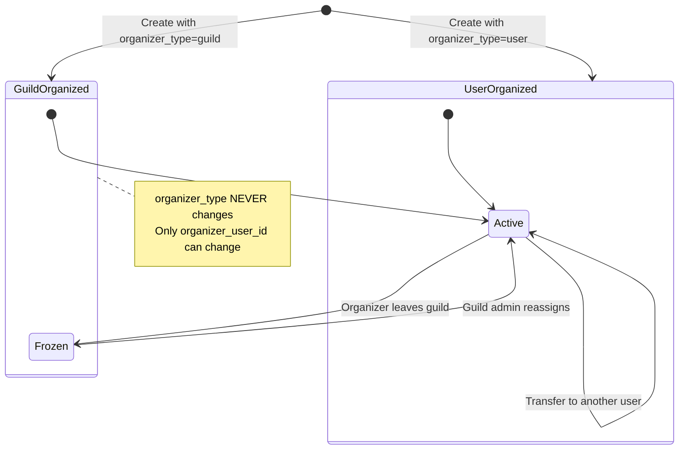

### Admission vs RSVP Flow

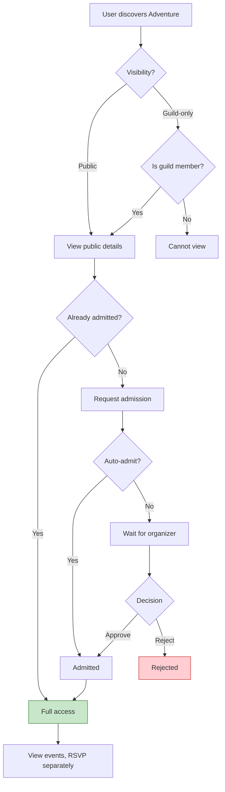

### Key Concepts

| Concept | Description |
|---------|-------------|
| **Admission** | Permission to view adventure and RSVP to events |
| **RSVP** | Actual commitment to attend specific event |
| **Organizer Type** | `guild` or `user` - NEVER changes after creation |
| **Organizer User** | The specific person organizing (can be transferred) |
| **Frozen State** | When guild organizer leaves guild, adventure freezes |

### Transfer Rules

1. `organizer_type` can **NEVER** change (no guild↔user flips)
2. For guild adventures: new organizer must be a guild member
3. For user adventures: requires explicit acceptance by new organizer
4. Frozen adventures can only be unfrozen by guild admins

---

## Voting System

Generic voting with multiple methods: FPTP, ranked choice, approval, and multi-select.

### Vote Lifecycle State Machine

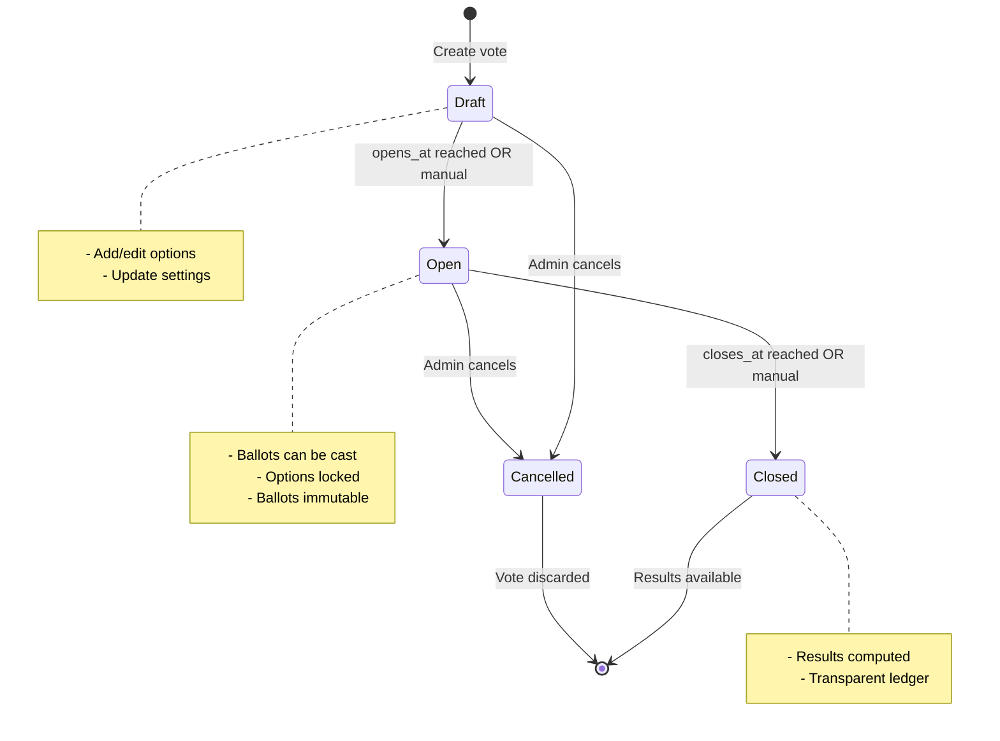

### Vote Types

| Type | Description | Ballot Format |
|------|-------------|---------------|
| `fptp` | First Past The Post | `{ "option_id": "..." }` |
| `ranked_choice` | Instant-runoff voting | `{ "rankings": ["opt1", "opt2", ...] }` |
| `approval` | Approve multiple options | `{ "approved_options": ["opt1", "opt2"] }` |
| `multi_select` | Select up to N options | `{ "selected_options": ["opt1", "opt2"] }` |

### Ranked Choice Result Computation

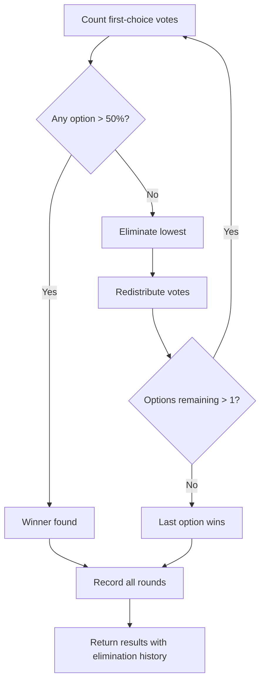

### Voting Domain ERD

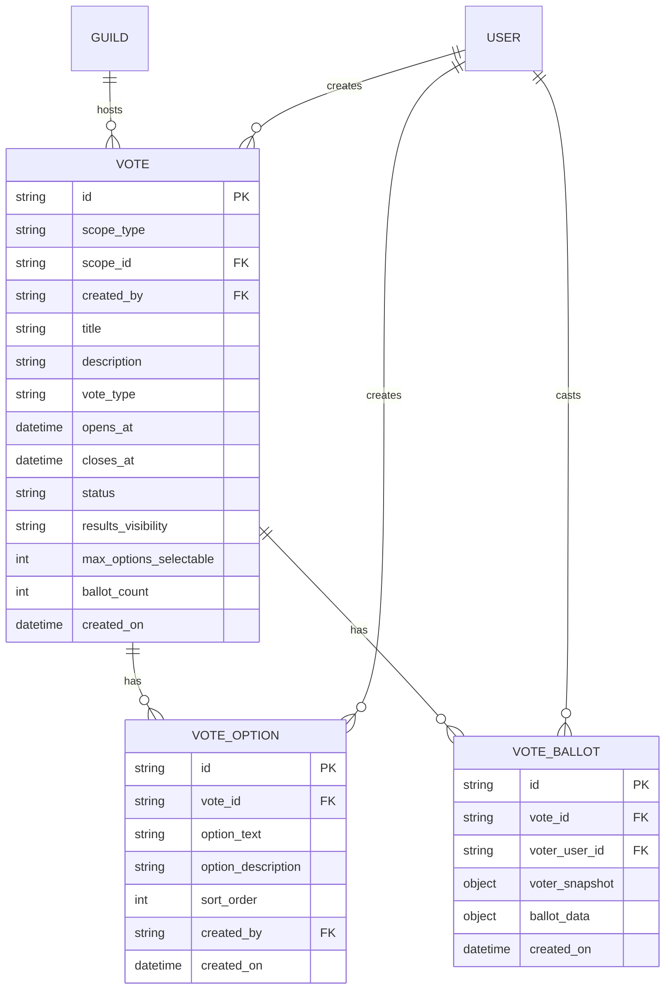

### Design Principles

1. **Ballot Immutability**: Once cast, ballots cannot be changed (enforced via database event)
2. **Transparent Ledger**: All ballots visible (who voted for what) based on `results_visibility`
3. **One Vote Per User**: Unique index on `(vote_id, voter_user_id)`
4. **Automatic Transitions**: Background job handles `draft→open` and `open→closed` transitions
5. **Guild vs Global**: Guild votes require membership; global votes require sysadmin to create

---

## Related Documentation

- [SCHEMA.md](./SCHEMA.md) - Complete schema reference
- [DATABASE.md](./DATABASE.md) - Database layer and transactions
- [PERFORMANCE.md](./PERFORMANCE.md) - Query optimization
