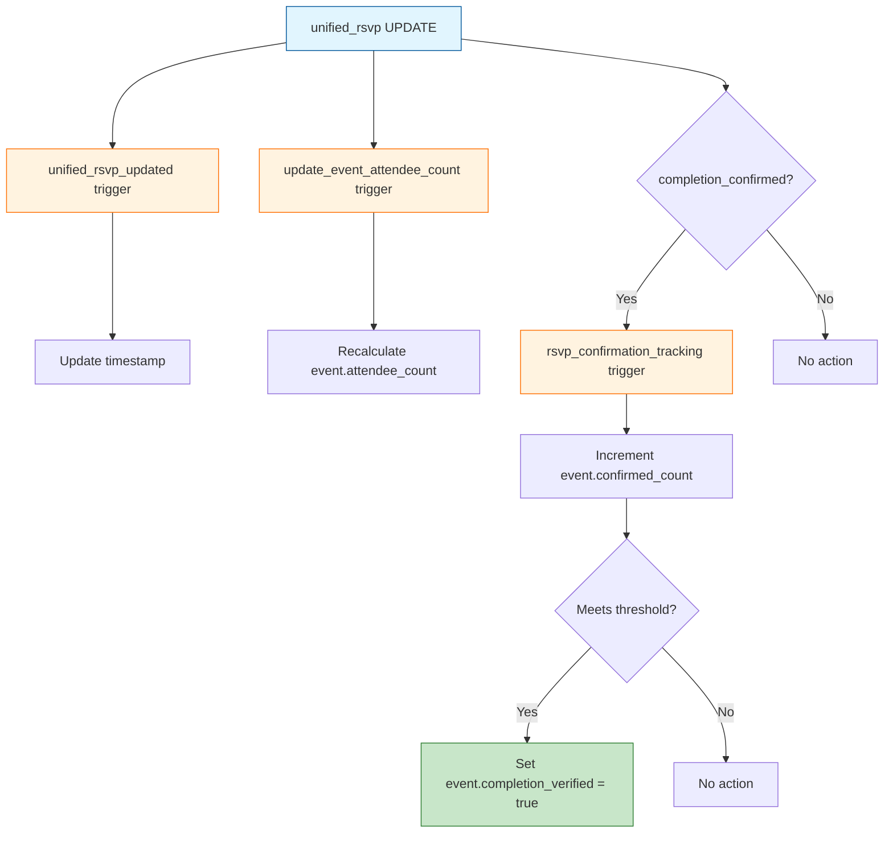

# Performance Guide

This document covers query optimization, trigger awareness, and scaling considerations for the Saga API.

## Table of Contents

- [Query Optimization](#query-optimization)
- [Trigger Cascade Awareness](#trigger-cascade-awareness)
- [Denormalization Strategy](#denormalization-strategy)
- [Scaling Bottlenecks](#scaling-bottlenecks)
- [Monitoring Recommendations](#monitoring-recommendations)

---

## Query Optimization

### Use Composite Indexes

The schema includes composite indexes for common query patterns. Always structure WHERE clauses to leverage them.

**Discovery queries:**
```sql
-- Uses idx_event_discover (visibility, status, starts_at)
SELECT * FROM event
WHERE visibility IN ["guilds", "public"]  -- First
  AND status = "upcoming"                  -- Second
  AND starts_at > time::now()              -- Third
ORDER BY starts_at ASC
```

**User's RSVPs:**
```sql
-- Uses idx_unified_rsvp_user_type_status (user_id, target_type, status)
SELECT * FROM unified_rsvp
WHERE user_id = $user_id    -- First (most selective)
  AND target_type = "event"  -- Second
  AND status = "approved"    -- Third
```

### Index Reference

| Query Pattern | Index | Columns |
|---------------|-------|---------|
| Event discovery | `idx_event_discover` | visibility, status, starts_at |
| Guild events | `idx_event_guild_time` | guild_id, starts_at |
| Adventure discovery | `idx_adventure_discover` | visibility, status, start_date |
| User RSVPs by type | `idx_unified_rsvp_user_type_status` | user_id, target_type, status |
| Eligible profiles | `idx_profile_eligible` | discovery_eligible, visibility |
| Active profiles | `idx_profile_active` | last_active |

### Avoid COUNT() in Hot Paths

**Bad - requires full scan:**
```sql
SELECT *, (SELECT count() FROM unified_rsvp WHERE target_id = id) as attendee_count
FROM event
WHERE guild_id = $guild_id
```

**Good - use denormalized field:**
```sql
SELECT * FROM event
WHERE guild_id = $guild_id
-- attendee_count is already maintained by trigger
```

### Batch Operations with AtomicBatch

When performing multiple related operations, use `AtomicBatch` instead of separate queries:

**Bad - 3 round trips:**
```go
db.Execute(ctx, query1, vars1)
db.Execute(ctx, query2, vars2)
db.Execute(ctx, query3, vars3)
```

**Good - 1 round trip:**
```go
batch := database.NewAtomicBatch()
batch.Add(query1, vars1)
batch.Add(query2, vars2)
batch.Add(query3, vars3)
batch.Execute(ctx, db)
```

### Limit Result Sets

Always include LIMIT for unbounded queries:

```sql
-- Good: bounded
SELECT * FROM event WHERE guild_id = $guild_id LIMIT 50

-- Bad: unbounded (could return thousands)
SELECT * FROM event WHERE guild_id = $guild_id
```

### Use FETCH for Relations

Avoid N+1 queries by fetching related records:

```sql
-- Good: single query with relation fetch
SELECT *, guild.* FROM event
WHERE id = $event_id
FETCH guild

-- Bad: requires second query for guild
SELECT * FROM event WHERE id = $event_id
-- Then: SELECT * FROM guild WHERE id = $event.guild_id
```

---

## Trigger Cascade Awareness

### RSVP Trigger Chain

A single `unified_rsvp` modification can trigger multiple events:



**Impact:** Each RSVP operation has overhead. For bulk imports, consider:
1. Disabling triggers temporarily
2. Using direct UPDATE without trigger-causing changes
3. Batching updates and running count recalculation once

### Answer Eligibility Check

The `answer_eligibility_check` trigger runs on every answer CREATE:

```sql
-- This runs for EVERY new answer
LET $categories = (SELECT DISTINCT question.category FROM answer WHERE user = $user_id);
LET $has_all = array::len(array::intersect($categories, fn::required_categories())) = 4;
```

**Performance concern:** User answering 50 questions = 50 eligibility checks.

**Mitigation strategies:**
1. Cache eligibility in application layer after first check
2. Use scheduled job instead of trigger for eligibility updates
3. Only check if user not already eligible

### Limit-Checking Triggers

30+ validation triggers run COUNT queries on every CREATE:

```sql
-- Example: check_pool_member_limit
LET $count = (SELECT count() FROM pool_member WHERE pool_id = $after.pool_id);
IF $count > 100 THEN THROW "...";
```

**Performance concern:** For large pools, this is expensive.

**Future optimization:** Replace with denormalized count fields.

---

## Denormalization Strategy

### Automatically Maintained Counts

These fields are kept in sync by triggers:

| Table | Field | Trigger |
|-------|-------|---------|
| `event` | `attendee_count` | `update_event_attendee_count` |
| `event` | `confirmed_count` | `rsvp_confirmation_tracking` |
| `adventure` | `participant_count` | `update_adventure_participant_count` |
| `guild` | `member_count` | `update_guild_member_count` |
| `interest` | `user_count` | `update_interest_user_count` |
| `event_role` | `filled_slots` | `increment/decrement_filled_slots` |
| `resonance_score` | all stats | `resonance_score_update` |

### When to Add New Denormalized Fields

Add denormalization when:
1. The aggregation is queried frequently (>100 times/day)
2. The aggregation is expensive (full table scan)
3. Write frequency is much lower than read frequency

**Pattern for new count field:**

```sql
-- 1. Add field
DEFINE FIELD member_count ON guild TYPE int DEFAULT 0;

-- 2. Create trigger
DEFINE EVENT update_guild_member_count ON TABLE responsible_for
    WHEN $event = "CREATE" OR $event = "DELETE" THEN {
    LET $guild_id = IF $event = "CREATE" THEN $after.out ELSE $before.out END;
    LET $count = (SELECT count() FROM responsible_for WHERE out = $guild_id GROUP ALL)[0].count;
    UPDATE $guild_id SET member_count = $count ?? 0;
};

-- 3. Backfill existing data
UPDATE guild SET member_count = (
    SELECT count() FROM responsible_for WHERE out = id GROUP ALL
)[0].count ?? 0;
```

### Avoiding Denormalization Drift

Denormalized counts can drift if:
- Records deleted outside triggers
- Triggers fail silently
- Manual database edits

**Recommended:** Add periodic audit job:

```go
func (j *AuditJob) ReconcileCounts(ctx context.Context) error {
    // Recalculate event attendee counts
    _, err := j.db.Execute(ctx, `
        UPDATE event SET attendee_count = (
            SELECT count() FROM unified_rsvp
            WHERE target_type = "event" AND target_id = id
              AND status IN ["approved", "pending"]
            GROUP ALL
        )[0].count ?? 0
    `, nil)
    return err
}
```

---

## Scaling Bottlenecks

### 1. Pool Matching Algorithm

**Problem:** 100 members × compatibility matrix = 10,000 comparisons

**Current approach:** Calculate all compatibilities at match time

**Optimization options:**
1. **Pre-compute compatibility scores** - Store in `user_compatibility` table, refresh weekly
2. **Use approximate matching** - Group by interests first, then calculate within groups
3. **Limit pool size** - Keep pools under 50 members

### 2. Resonance Score Calculation

**Problem:** Ledger can grow unbounded

**Current approach:** Trigger-based incremental updates to `resonance_score`

**Why it works:** Each ledger entry updates cached score immediately - no aggregation needed at read time.

**Consideration:** If triggers disabled or fail, scores become stale. Add reconciliation job.

### 3. Geo Queries (Distance Calculation)

**Problem:** Radius queries with time overlap are expensive

**Current schema:** Location stored as raw coordinates, distance calculated per query

**Optimization options:**
1. **Geo-spatial indexing** - SurrealDB supports geospatial indexes
2. **Grid-based bucketing** - Pre-compute grid cell, query by cell
3. **Distance tier caching** - Store pre-calculated distance tiers

```sql
-- Future: add geospatial index
DEFINE INDEX idx_profile_location ON user_profile
    FIELDS location.point
    USING GEOSPATIAL;

-- Query with index
SELECT * FROM user_profile
WHERE geo::distance(location.point, $viewer_point) < 10000
```

### 4. Forum Thread Depth

**Problem:** Deeply nested replies create recursive query issues

**Current approach:** `reply_to_id` field creates tree structure

**Optimization options:**
1. **Materialized path** - Store path as string: "1/5/12/45"
2. **Depth limit** - Enforce max depth (5 levels)
3. **Flat with sorting** - Store depth + sort order, fetch flat

### 5. Nudge Delivery

**Problem:** Checking cooldowns for millions of users

**Current approach:** Per-type cooldown in `nudge_preference`

**Optimization options:**
1. **Batch processing** - Process nudges in batches with priority queue
2. **TTL-based cleanup** - Auto-expire old nudge_history records
3. **Sharding** - Partition by user_id hash

---

## Monitoring Recommendations

### Query Execution Metrics

Add timing to repository methods:

```go
func (r *EventRepository) GetByID(ctx context.Context, id string) (*model.Event, error) {
    start := time.Now()
    defer func() {
        metrics.RecordQueryDuration("event_get_by_id", time.Since(start))
    }()

    // ... query execution
}
```

### Slow Query Detection

Log queries exceeding threshold:

```go
const slowQueryThreshold = 100 * time.Millisecond

func (s *SurrealDB) Query(ctx context.Context, query string, vars map[string]interface{}) ([]interface{}, error) {
    start := time.Now()
    result, err := s.db.Query(query, vars)
    duration := time.Since(start)

    if duration > slowQueryThreshold {
        log.Warn("Slow query detected",
            "duration", duration,
            "query", query[:min(100, len(query))],
        )
    }

    return result, err
}
```

### Trigger Cascade Monitoring

Track trigger execution in high-traffic scenarios:

```sql
-- Add logging to heavy triggers (during debugging only)
DEFINE EVENT update_event_attendee_count ON TABLE unified_rsvp
    WHEN $event = "CREATE" OR $event = "DELETE" THEN {
    -- Log for monitoring
    CREATE debug_log SET
        trigger = "update_event_attendee_count",
        target_id = $after.target_id ?? $before.target_id,
        timestamp = time::now();

    -- Original logic...
};
```

### Index Usage Verification

Use SurrealDB's EXPLAIN to verify index usage:

```sql
EXPLAIN SELECT * FROM event
WHERE visibility IN ["guilds", "public"]
  AND status = "upcoming"
  AND starts_at > time::now()
```

### Key Metrics to Track

| Metric | Warning Threshold | Action |
|--------|-------------------|--------|
| Query p95 latency | > 100ms | Optimize query or add index |
| Trigger cascade depth | > 3 | Review trigger dependencies |
| Denormalized count drift | > 1% | Run reconciliation job |
| Daily discovery queries | > 10k/user | Check for abuse |
| Resonance ledger size | > 1M/user | Archive old entries |

---

## Best Practices Summary

1. **Always use indexed columns first** in WHERE clauses
2. **Avoid COUNT() in hot paths** - use denormalized counts
3. **Batch related operations** with AtomicBatch
4. **Include LIMIT** on all unbounded queries
5. **Use FETCH** to avoid N+1 queries
6. **Monitor trigger cascades** during bulk operations
7. **Add reconciliation jobs** for denormalized data
8. **Log slow queries** for optimization targeting
9. **Pre-compute expensive calculations** (compatibility, distance)
10. **Test with realistic data volumes** before production

---

## Related Documentation

- [DATABASE.md](./DATABASE.md) - Database layer and transactions
- [SCHEMA.md](./SCHEMA.md) - Complete schema reference with all indexes
- [ARCHITECTURE.md](./ARCHITECTURE.md) - System overview
