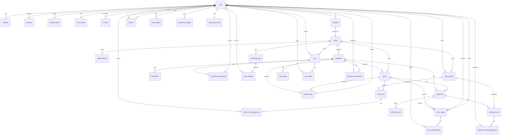

# Schema Reference

This document provides a comprehensive reference for the Saga database schema, including all triggers, functions, and indexes.

## Table of Contents

- [Tables Overview](#tables-overview)
- [Triggers](#triggers)
- [Functions](#functions)
- [Security Functions](#security-functions)
- [Indexes](#indexes)
- [Denormalized Fields](#denormalized-fields)

---

## Entity Relationships

The following diagram shows key relationships between core entities, organized by domain:



**Relationship Notation:**
- `||--o{` = one-to-many
- `||--||` = one-to-one
- `}o--||` = many-to-one

---

## Tables Overview

The schema contains **81 tables** organized into logical domains:

| Domain | Tables | Description |
|--------|--------|-------------|
| **Auth** | `user`, `identity`, `passkey`, `refresh_token` | User accounts and authentication |
| **Profile** | `user_profile`, `answer`, `user_bias_profile` | User profiles and questionnaire responses |
| **Guild** | `guild`, `member`, `guild_alliance`, `guild_moderation_settings` | Community groups |
| **Events** | `event`, `event_role`, `event_role_assignment`, `event_host`, `event_rsvp` | Scheduled gatherings |
| **Adventures** | `adventure`, `destination`, `adventure_activity`, `adventure_participant`, `adventure_admission`, `destination_vote`, `activity_vote` | Multi-day trips with admission control |
| **RSVPs** | `unified_rsvp` | Polymorphic attendance tracking |
| **Rideshares** | `rideshare`, `rideshare_segment`, `rideshare_seat` | Transportation coordination |
| **Forums** | `forum`, `forum_post` | Discussion threads |
| **Matching** | `matching_pool`, `pool_member`, `match_result` | Donut-style matching |
| **Discovery** | `discovery_daily_count`, `availability`, `hangout`, `hangout_request` | Finding people/events |
| **Resonance** | `resonance_ledger`, `resonance_score`, `resonance_daily_cap`, `support_pair_count` | Gamification scoring |
| **Trust** | `trust_relation`, `irl_verification`, `review`, `trust_rating`, `trust_rating_history`, `trust_endorsement`, `trust_rating_daily_count` | Reputation and trust system |
| **Moderation** | `report`, `moderation_action`, `block`, `user_block`, `user_flag`, `user_moderation` | Safety enforcement |
| **Nudges** | `nudge`, `nudge_history`, `nudge_preference`, `nudge_settings` | Notifications |
| **Role Catalogs** | `role_catalog`, `rideshare_role`, `rideshare_role_assignment` | Reusable role templates |
| **Voting** | `vote`, `vote_option`, `vote_ballot` | Generic voting system |
| **Devices** | `device_token` | Push notification tokens |
| **Relationships** | `person`, `activity`, `timer`, `reminder` | Relationship tracking |
| **Relations** | `part_of`, `responsible_for`, `managed_by`, `tracked_by`, `adheres_to`, `authenticates_via`, `has_interest`, `event_participant`, `rsvp` | Graph-style relations |

---

## Triggers

Saga uses **106 database triggers** organized into categories for validation, automation, and data integrity. Full SQL for all triggers is in the `api/migrations/` directory.

**Trigger Summary by Migration:**

| Migration | Trigger Count | Purpose |
|-----------|---------------|---------|
| 001_initial_schema | 44 | Core validation (limits, enums), auto-updates |
| 002_schema_hardening | 8 | Unified RSVP, discovery, visibility cascade |
| 003_bug_fixes | 3 | Block validation, count maintenance |
| 004_security_hardening | 5 | User/profile auto-updates, block checks |
| 005_performance_indexes | 8 | Denormalized count maintenance |
| 006_data_model_cleanup | 17 | Cascade deletes, data validation |
| 007_features_v2 | 21 | Trust ratings, voting, role catalogs |

### Validation Triggers

These enforce business rules and prevent invalid data:

| Trigger | Table | Condition | Rule |
|---------|-------|-----------|------|
| `check_person_limit` | `part_of` | CREATE | Max 50 people per guild |
| `check_member_limit` | `responsible_for` | CREATE | Max 20 members per guild |
| `check_activity_limit` | `managed_by` | CREATE | Max 50 activities per guild |
| `check_timer_limit` | `tracked_by` | CREATE | Max 50 timers per person |
| `check_role_limit` | `event_role` | CREATE | Max 20 roles per event |
| `check_user_role_limit` | `event_role_assignment` | CREATE | Max 10 roles per user per event |
| `check_host_limit` | `event_host` | CREATE | Max 5 hosts per event |
| `check_seat_limit` | `rideshare_seat` | CREATE | Max 8 seats per rideshare |
| `check_segment_limit` | `rideshare_segment` | CREATE | Max 10 segments per rideshare |
| `check_pool_limit` | `matching_pool` | CREATE | Max 10 pools per guild |
| `check_pool_member_limit` | `pool_member` | CREATE | Max 100 members per pool |
| `check_exclusion_limit` | `pool_member` | CREATE/UPDATE | Max 20 exclusions per member |
| `check_nudge_type` | `nudge` | CREATE | Validates nudge type enum |
| `check_nudge_channel` | `nudge` | CREATE/UPDATE | Validates channel (sse/push) |
| `check_quiet_hours` | `nudge_settings` | CREATE/UPDATE | Hours must be 0-23 |
| `check_adventure_status` | `adventure` | CREATE/UPDATE | Validates status enum |
| `check_adventure_participant_role` | `adventure_participant` | CREATE/UPDATE | Role must be organizer/participant |
| `check_adventure_participant_status` | `adventure_participant` | CREATE/UPDATE | Status must be interested/committed/maybe/out |
| `check_adventure_dates` | `adventure` | CREATE/UPDATE | End date > start date |
| `check_destination_limit` | `destination` | CREATE | Max 20 destinations per adventure |
| `check_adventure_activity_limit` | `adventure_activity` | CREATE | Max 50 activities per adventure |
| `check_adventure_event_limit` | `event` | CREATE | Max 20 events per adventure |
| `check_event_rideshare_limit` | `rideshare` | CREATE | Max 10 rideshares per event |
| `check_adventure_rideshare_limit` | `rideshare` | CREATE | Max 20 rideshares per adventure |
| `check_rideshare_parent` | `rideshare` | CREATE | Must have event OR adventure parent |
| `check_alliance_status` | `guild_alliance` | CREATE/UPDATE | Status must be pending/active/revoked |
| `check_self_alliance` | `guild_alliance` | CREATE | Guild cannot ally with itself |
| `check_forum_post_limit` | `forum_post` | CREATE | Max 1000 posts per forum |
| `check_forum_parent` | `forum` | CREATE | Must have adventure OR event parent (XOR) |
| `report_self_check` | `report` | CREATE | Cannot report yourself |
| `block_self_check` | `block` | CREATE | Cannot block yourself |
| `user_block_self_check` | `user_block` | CREATE | Cannot block yourself (added in migration 003) |

### Auto-Update Triggers

These maintain timestamps automatically:

| Trigger | Table | Updates |
|---------|-------|---------|
| `pool_updated` | `matching_pool` | `updated_on = time::now()` |
| `match_updated` | `match_result` | `updated_on = time::now()` |
| `nudge_preference_updated` | `nudge_preference` | `updated_on = time::now()` |
| `nudge_settings_updated` | `nudge_settings` | `updated_on = time::now()` |
| `adventure_updated` | `adventure` | `updated_on = time::now()` |
| `adventure_participant_updated` | `adventure_participant` | `updated_on = time::now()` |
| `destination_vote_updated` | `destination_vote` | `updated_on = time::now()` |
| `adventure_activity_updated` | `adventure_activity` | `updated_on = time::now()` |
| `rideshare_updated` | `rideshare` | `updated_on = time::now()` |
| `forum_post_updated` | `forum_post` | `updated_on = time::now()` |
| `unified_rsvp_updated` | `unified_rsvp` | `updated_on = time::now()` |

### Data Mutation Triggers

These automate data updates and business logic:

| Trigger | Table | Behavior |
|---------|-------|----------|
| `increment_filled_slots` | `event_role_assignment` | On CREATE: Updates `event_role.filled_slots += 1` |
| `decrement_filled_slots` | `event_role_assignment` | On DELETE: Updates `event_role.filled_slots -= 1` |
| `rsvp_confirmation_tracking` | `unified_rsvp` | When completion_confirmed set: Increments `event.confirmed_count` |
| `update_event_attendee_count` | `unified_rsvp` | On CREATE/DELETE: Recalculates `event.attendee_count` |
| `update_adventure_participant_count` | `adventure_participant` | On CREATE/DELETE: Recalculates `adventure.participant_count` |
| `update_guild_member_count` | `responsible_for` | On CREATE/DELETE: Recalculates `guild.member_count` |
| `update_interest_user_count` | `has_interest` | On CREATE/DELETE: Recalculates `interest.user_count` |
| `visibility_cascade_event` | `event` | On CREATE/UPDATE: Validates visibility <= parent adventure |
| `visibility_cascade_rideshare` | `rideshare` | On CREATE/UPDATE: Validates visibility <= parent event/adventure |
| `resonance_score_update` | `resonance_ledger` | On CREATE: Updates `resonance_score` table with floor at 0 |
| `answer_eligibility_check` | `answer` | On CREATE: Updates `user_profile.discovery_eligible` |
| `update_event_counts` | `unified_rsvp` | On CREATE/UPDATE/DELETE: Recalculates all event count fields |

### Cascade Delete Triggers

These triggers clean up related records when parent entities are deleted (migration 006):

| Trigger | Table | Behavior |
|---------|-------|----------|
| `cascade_guild_delete` | `guild` | Deletes events, pools, values, members, alliances |
| `cascade_adventure_delete` | `adventure` | Deletes events, destinations, participants, rideshares, forums |
| `cascade_event_delete` | `event` | Deletes RSVPs, roles, hosts, rideshares, forums |
| `cascade_destination_delete` | `destination` | Deletes destination votes |
| `cascade_rideshare_delete` | `rideshare` | Deletes seats and segments |
| `cascade_pool_delete` | `matching_pool` | Deletes members and match results |
| `cascade_user_delete` | `user` | Deletes all user-owned data |
| `cascade_member_delete` | `member` | Deletes guild memberships, pool memberships |
| `cascade_forum_delete` | `forum` | Deletes all forum posts |
| `cascade_event_role_delete` | `event_role` | Deletes role assignments |

### Trust Rating Triggers

These enforce trust rating rules (migration 007):

| Trigger | Table | Behavior |
|---------|-------|----------|
| `trust_rating_self_check` | `trust_rating` | Prevents self-rating |
| `trust_rating_updated` | `trust_rating` | Auto-updates timestamp on changes |
| `trust_rating_history_on_update` | `trust_rating` | Creates immutable audit entry |
| `trust_endorsement_self_check` | `trust_endorsement` | Prevents endorsing own ratings |
| `trust_rating_daily_limit` | `trust_rating` | Enforces 10 ratings/day limit |

### Voting System Triggers

These enforce voting rules (migration 007):

| Trigger | Table | Behavior |
|---------|-------|----------|
| `prevent_ballot_update` | `vote_ballot` | Ballots are immutable |
| `validate_vote_dates` | `vote` | Close time must be after open time |
| `check_vote_option_limit` | `vote_option` | Max 20 options per vote |
| `check_guild_vote_limit` | `vote` | Max 50 active votes per guild |
| `prevent_option_change_after_voting` | `vote_option` | Cannot modify after voting starts |

---

## Functions

The schema defines **28 custom functions** across security, discovery, and helper categories:

**Function Summary:**

| Function | Category | Purpose |
|----------|----------|---------|
| `fn::distance_bucket` | Location | Converts coordinates to privacy bucket |
| `fn::coarse_location` | Location | Strips coordinates from location object |
| `fn::safe_profile` | Location | Returns profile without coordinates |
| `fn::required_categories` | Discovery | Returns required question categories |
| `fn::check_eligibility` | Discovery | Checks if user can be discovered |
| `fn::has_discovery_quota` | Discovery | Checks daily discovery limit |
| `fn::increment_discovery_count` | Discovery | Increments daily count |
| `fn::check_event_completion` | Events | Checks if event is verified complete |
| `fn::is_early_confirm` | Events | Checks if confirmation is ≥2h before event |
| `fn::is_ontime_checkin` | Events | Checks if checkin is within ±10min window |
| `fn::visibility_level` | Access | Converts visibility string to numeric level |
| `fn::is_blocked` | Security | Bidirectional block check |
| `fn::get_blocked_users` | Security | Returns all blocked user IDs |
| `fn::is_guild_member` | Security | Checks guild membership |
| `fn::shares_guild` | Security | Checks if users share any guild |
| `fn::shares_alliance` | Security | Checks if users' guilds are allied |
| `fn::can_view_guild` | Security | Guild access control |
| `fn::can_access` | Security | Master access control function |
| `fn::get_safe_profile` | Security | Profile with all access checks |
| `fn::paginate_guild_events` | Pagination | Cursor-based event pagination |
| `fn::paginate_upcoming_events` | Pagination | Visibility-aware event pagination |
| `fn::paginate_forum_posts` | Pagination | Threaded forum pagination |
| `fn::paginate_availability` | Pagination | Geo-aware availability pagination |
| `fn::can_rate_user` | Trust | Validates rating eligibility |
| `fn::get_trust_aggregate` | Trust | Aggregates trust/distrust counts |
| `fn::can_create_guild_vote` | Voting | Checks vote creation permission |
| `fn::can_vote_in_guild` | Voting | Checks voting permission |
| `fn::is_admitted_to_adventure` | Adventures | Checks adventure admission status |

### Location Privacy Functions

These enforce location privacy at the database level:

#### `fn::distance_bucket($lat1, $lng1, $lat2, $lng2)`

Calculates distance between two coordinates and returns a privacy-preserving bucket.

```sql
DEFINE FUNCTION fn::distance_bucket($lat1: float, $lng1: float, $lat2: float, $lng2: float) {
    LET $distance = geo::distance(
        { type: "Point", coordinates: [$lng1, $lat1] },
        { type: "Point", coordinates: [$lng2, $lat2] }
    );
    RETURN IF $distance < 1000 THEN "nearby"
        ELSE IF $distance < 2000 THEN "~2km"
        ELSE IF $distance < 5000 THEN "~5km"
        ELSE IF $distance < 10000 THEN "~10km"
        ELSE IF $distance < 20000 THEN "~20km"
        ELSE ">20km"
    END;
};
```

**Returns:** `"nearby"`, `"~2km"`, `"~5km"`, `"~10km"`, `"~20km"`, or `">20km"`

**Usage:** Always use instead of exposing actual distances.

#### `fn::coarse_location($location)`

Extracts non-sensitive location information from a location object.

```sql
DEFINE FUNCTION fn::coarse_location($location: object) {
    RETURN {
        city: $location.city,
        neighborhood: $location.neighborhood,
        country: $location.country,
        timezone: $location.timezone
    };
    -- NEVER returns lat/lng
};
```

**Returns:** Object with city, neighborhood, country, timezone only.

#### `fn::safe_profile($profile_id, $viewer_lat, $viewer_lng)`

Returns a privacy-respecting view of a user profile for another user.

```sql
DEFINE FUNCTION fn::safe_profile($profile_id: record<user_profile>, $viewer_lat: float, $viewer_lng: float) {
    LET $profile = (SELECT * FROM $profile_id)[0];
    RETURN {
        id: $profile.id,
        user: $profile.user,
        bio: $profile.bio,
        tagline: $profile.tagline,
        languages: $profile.languages,
        timezone: $profile.timezone,
        city: $profile.location.city,
        neighborhood: $profile.location.neighborhood,
        country: $profile.location.country,
        distance_bucket: fn::distance_bucket(
            $profile.location.lat, $profile.location.lng,
            $viewer_lat, $viewer_lng
        ),
        visibility: $profile.visibility,
        last_active: $profile.last_active,
        discovery_eligible: $profile.discovery_eligible
    };
};
```

**API Usage:**
```go
query := `SELECT fn::safe_profile($profile_id, $viewer_lat, $viewer_lng)`
vars := map[string]interface{}{
    "profile_id": targetProfileID,
    "viewer_lat": viewerLocation.Lat,
    "viewer_lng": viewerLocation.Lng,
}
```

### Discovery Functions

#### `fn::required_categories()`

Returns the list of question categories required for discovery eligibility.

```sql
DEFINE FUNCTION fn::required_categories() {
    RETURN ["values", "social", "lifestyle", "communication"];
};
```

#### `fn::check_eligibility($user_id)`

Checks if a user has answered questions from all required categories.

```sql
DEFINE FUNCTION fn::check_eligibility($user_id: record<user>) {
    LET $answered_categories = (
        SELECT array::distinct(question.category)
        FROM answer WHERE user = $user_id
    )[0];

    LET $required = fn::required_categories();
    LET $has_all = array::len(
        array::intersect($answered_categories, $required)
    ) = array::len($required);

    RETURN $has_all;
};
```

**Returns:** `true` if user has answered from all 4 required categories.

#### `fn::has_discovery_quota($user_id, $type, $limit)`

Checks if user has remaining discovery quota for the day.

```sql
DEFINE FUNCTION fn::has_discovery_quota($user_id: record<user>, $type: string, $limit: int) {
    LET $today = time::format(time::now(), "%Y-%m-%d");
    LET $record = (SELECT * FROM discovery_daily_count
        WHERE user_id = $user_id AND date = $today)[0];

    IF $record = NONE THEN {
        RETURN true;
    };

    LET $current = IF $type = "people" THEN $record.people_shown
        ELSE IF $type = "events" THEN $record.events_shown
        ELSE $record.guilds_shown END;

    RETURN $current < $limit;
};
```

**Usage:**
```sql
IF fn::has_discovery_quota(user:abc, "people", 10) THEN {
    -- Allow discovery
}
```

#### `fn::increment_discovery_count($user_id, $type)`

Increments the daily discovery count for a user.

```sql
DEFINE FUNCTION fn::increment_discovery_count($user_id: record<user>, $type: string) {
    LET $today = time::format(time::now(), "%Y-%m-%d");

    UPSERT discovery_daily_count SET
        user_id = $user_id,
        date = $today,
        people_shown += IF $type = "people" THEN 1 ELSE 0 END,
        events_shown += IF $type = "events" THEN 1 ELSE 0 END,
        guilds_shown += IF $type = "guilds" THEN 1 ELSE 0 END,
        updated_on = time::now()
    WHERE user_id = $user_id AND date = $today;

    RETURN true;
};
```

### Event Verification Functions

#### `fn::check_event_completion($event_id)`

Determines if an event meets completion verification requirements.

```sql
DEFINE FUNCTION fn::check_event_completion($event_id: record<event>) {
    LET $event = (SELECT * FROM $event_id)[0];
    LET $confirmations = $event.confirmed_count;

    -- 1:1 events: both parties must confirm
    IF $event.max_attendees <= 2 THEN {
        RETURN $confirmations >= 2;
    };

    -- Group events: host + at least 2 attendees
    RETURN $confirmations >= 3;
};
```

**Returns:** `true` if event completion is verified.

#### `fn::is_early_confirm($event_id)`

Checks if a confirmation happened at least 2 hours before event start.

```sql
DEFINE FUNCTION fn::is_early_confirm($event_id: record<event>) {
    LET $event = (SELECT starts_at FROM $event_id)[0];
    LET $threshold = $event.starts_at - 2h;

    RETURN time::now() < $threshold;
};
```

**Usage:** Used for bonus resonance points.

#### `fn::is_ontime_checkin($event_id, $checkin_time)`

Checks if a checkin is within the ±10 minute window of event start.

```sql
DEFINE FUNCTION fn::is_ontime_checkin($event_id: record<event>, $checkin_time: datetime) {
    LET $event = (SELECT starts_at FROM $event_id)[0];
    LET $window_start = $event.starts_at - 10m;
    LET $window_end = $event.starts_at + 10m;

    RETURN $checkin_time >= $window_start AND $checkin_time <= $window_end;
};
```

**Usage:** Used for on-time attendance tracking.

### Helper Functions

#### `fn::visibility_level($visibility)`

Converts visibility string to numeric level for comparison.

```sql
DEFINE FUNCTION fn::visibility_level($visibility: string) {
    RETURN IF $visibility = "private" THEN 0
        ELSE IF $visibility = "invite_only" THEN 1
        ELSE IF $visibility = "guilds" THEN 2
        ELSE 3 END;
};
```

**Levels:**
- `0` = private
- `1` = invite_only
- `2` = guilds
- `3` = public

---

## Security Functions

Added in migration 004, these functions enforce access control at the database level.

### Block Checking

#### `fn::is_blocked($user_a, $user_b)`

Checks if either user has blocked the other (bidirectional check).

```sql
DEFINE FUNCTION fn::is_blocked($user_a: string, $user_b: string) {
    LET $count = SELECT count() FROM block
        WHERE (blocker_user_id = type::record("user", $user_a)
               AND blocked_user_id = type::record("user", $user_b))
           OR (blocker_user_id = type::record("user", $user_b)
               AND blocked_user_id = type::record("user", $user_a))
        GROUP ALL;
    RETURN ($count[0].count ?? 0) > 0;
};
```

**Returns:** `true` if either user has blocked the other.

**Usage:**
```sql
IF fn::is_blocked("user123", "user456") THEN {
    -- Don't show these users to each other
}
```

#### `fn::get_blocked_users($user_id)`

Returns all user IDs that are blocked by or have blocked the given user.

```sql
DEFINE FUNCTION fn::get_blocked_users($user_id: string) {
    LET $blocked_by_me = SELECT blocked_user_id FROM block
        WHERE blocker_user_id = type::record("user", $user_id);
    LET $blocked_me = SELECT blocker_user_id FROM block
        WHERE blocked_user_id = type::record("user", $user_id);
    RETURN array::union($blocked_by_me, $blocked_me);
};
```

**Returns:** Array of user IDs to exclude from discovery.

### Guild Membership

#### `fn::is_guild_member($user_id, $guild_id)`

Checks if a user is a member of a specific guild.

```sql
DEFINE FUNCTION fn::is_guild_member($user_id: string, $guild_id: string) {
    LET $count = SELECT count() FROM member
        WHERE user = type::record("user", $user_id)
        AND id IN (SELECT in FROM responsible_for
                   WHERE out = type::record("guild", $guild_id))
        GROUP ALL;
    RETURN ($count[0].count ?? 0) > 0;
};
```

**Returns:** `true` if user is a member of the guild.

#### `fn::shares_guild($user_a, $user_b)`

Checks if two users share at least one guild membership.

```sql
DEFINE FUNCTION fn::shares_guild($user_a: string, $user_b: string) {
    LET $guilds_a = SELECT out FROM responsible_for
        WHERE in IN (SELECT id FROM member
                     WHERE user = type::record("user", $user_a));
    LET $shared = SELECT count() FROM responsible_for
        WHERE in IN (SELECT id FROM member
                     WHERE user = type::record("user", $user_b))
        AND out IN $guilds_a.out
        GROUP ALL;
    RETURN ($shared[0].count ?? 0) > 0;
};
```

**Returns:** `true` if users share any guild.

**Usage:** Used to enforce "guilds" visibility level.

### Alliance Membership

#### `fn::shares_alliance($user_a, $user_b)`

Checks if two users are members of allied guilds.

```sql
DEFINE FUNCTION fn::shares_alliance($user_a: string, $user_b: string) {
    LET $guilds_a = SELECT out FROM responsible_for
        WHERE in IN (SELECT id FROM member
                     WHERE user = type::record("user", $user_a));
    LET $guilds_b = SELECT out FROM responsible_for
        WHERE in IN (SELECT id FROM member
                     WHERE user = type::record("user", $user_b));
    LET $alliance_count = SELECT count() FROM guild_alliance
        WHERE status = "active"
        AND ((guild_a_id IN $guilds_a.out AND guild_b_id IN $guilds_b.out)
             OR (guild_b_id IN $guilds_a.out AND guild_a_id IN $guilds_b.out))
        GROUP ALL;
    RETURN ($alliance_count[0].count ?? 0) > 0;
};
```

**Returns:** `true` if users' guilds are allied.

### Access Control

#### `fn::can_view_guild($viewer_id, $guild_id)`

Determines if a viewer can access a guild based on its visibility.

```sql
DEFINE FUNCTION fn::can_view_guild($viewer_id: string, $guild_id: string) {
    LET $guild = SELECT visibility FROM guild
                 WHERE id = type::record("guild", $guild_id);
    LET $visibility = $guild[0].visibility ?? "private";

    IF $visibility IN ["public", "guilds"] THEN RETURN true END;
    RETURN fn::is_guild_member($viewer_id, $guild_id);
};
```

**Returns:** `true` if viewer has access to the guild.

#### `fn::can_access($viewer_id, $owner_id, $visibility)`

Master access control function combining all checks.

```sql
DEFINE FUNCTION fn::can_access($viewer_id: string, $owner_id: string,
                                $visibility: string) {
    -- Step 1: Always check blocks first
    IF fn::is_blocked($viewer_id, $owner_id) THEN RETURN false END;

    -- Step 2: Check visibility level
    IF $visibility = "public" THEN RETURN true END;
    IF $visibility = "private" THEN RETURN $viewer_id = $owner_id END;
    IF $visibility = "guilds" THEN
        RETURN fn::shares_guild($viewer_id, $owner_id)
    END;
    IF $visibility = "alliance" THEN {
        RETURN fn::shares_guild($viewer_id, $owner_id)
            OR fn::shares_alliance($viewer_id, $owner_id);
    };
    IF $visibility = "invite_only" THEN RETURN false END;
    RETURN false;
};
```

**Returns:** `true` if viewer can access content.

**Usage:**
```sql
SELECT * FROM event
WHERE fn::can_access($viewer_id, string::split(string(created_by), ":")[1], visibility)
```

#### `fn::get_safe_profile($viewer_id, $target_id)`

Returns a privacy-respecting profile with all access checks applied.

```sql
DEFINE FUNCTION fn::get_safe_profile($viewer_id: string, $target_id: string) {
    IF fn::is_blocked($viewer_id, $target_id) THEN RETURN NONE END;

    LET $profile = SELECT * FROM user_profile
                   WHERE user = type::record("user", $target_id);
    IF array::len($profile) = 0 THEN RETURN NONE END;

    LET $p = $profile[0];
    IF $p.visibility = "private" THEN RETURN NONE END;
    IF $p.visibility = "guilds"
       AND NOT fn::shares_guild($viewer_id, $target_id) THEN {
        RETURN NONE;
    };

    RETURN {
        user_id: $target_id,
        bio: $p.bio,
        tagline: $p.tagline,
        languages: $p.languages,
        city: $p.location.city,
        country: $p.location.country,
        visibility: $p.visibility,
        last_active: $p.last_active
    };
};
```

**Returns:** Safe profile object or `NONE` if access denied.

### Security Function Summary

| Function | Purpose | Returns |
|----------|---------|---------|
| `fn::is_blocked` | Check bidirectional block | `bool` |
| `fn::get_blocked_users` | Get all blocked user IDs | `array<string>` |
| `fn::is_guild_member` | Check guild membership | `bool` |
| `fn::shares_guild` | Check shared guild | `bool` |
| `fn::shares_alliance` | Check allied guilds | `bool` |
| `fn::can_view_guild` | Check guild access | `bool` |
| `fn::can_access` | Master access check | `bool` |
| `fn::get_safe_profile` | Get privacy-safe profile | `object \| NONE` |

---

## Pagination Functions

Added in migration 005, these provide efficient cursor-based pagination.

#### `fn::paginate_guild_events($guild_id, $cursor, $limit)`

Returns events for a guild with cursor-based pagination.

```sql
DEFINE FUNCTION fn::paginate_guild_events($guild_id: string, $cursor: option<datetime>, $limit: int) {
    IF $cursor IS NONE {
        RETURN SELECT * FROM event
            WHERE guild_id = type::record("guild", $guild_id)
            ORDER BY created_on DESC LIMIT $limit;
    };
    RETURN SELECT * FROM event
        WHERE guild_id = type::record("guild", $guild_id)
        AND created_on < $cursor
        ORDER BY created_on DESC LIMIT $limit;
};
```

#### `fn::paginate_upcoming_events($viewer_id, $cursor, $limit)`

Returns visibility-aware upcoming events.

#### `fn::paginate_forum_posts($forum_id, $cursor, $limit)`

Returns threaded forum posts with nested replies (max 5 per parent).

#### `fn::paginate_availability($viewer_lat, $viewer_lng, $radius_km, $cursor, $limit)`

Returns geo-filtered availability records with bounding box optimization.

---

## Trust and Voting Functions

Added in migration 007, these support the trust rating and voting systems.

#### `fn::can_rate_user($rater_id, $ratee_id, $anchor_type, $anchor_id)`

Validates that a user can rate another based on shared event/rideshare participation.

**Rules:**
- Both users must have confirmed attendance at the anchor event
- For rideshares, both must be driver or confirmed passenger
- Anchor must be verified complete

#### `fn::get_trust_aggregate($user_id)`

Returns aggregated trust statistics for a user.

```sql
DEFINE FUNCTION fn::get_trust_aggregate($user_id: string) {
    LET $received = SELECT count() as cnt, trust_level FROM trust_rating
        WHERE ratee_id = type::record("user", $user_id)
        GROUP BY trust_level;
    LET $trust_count = $received[trust_level="trust"].cnt ?? 0;
    LET $distrust_count = $received[trust_level="distrust"].cnt ?? 0;
    RETURN {
        trust_count: $trust_count,
        distrust_count: $distrust_count,
        net_trust: $trust_count - $distrust_count
    };
};
```

#### `fn::can_create_guild_vote($user_id, $guild_id)`

Checks if user has permission to create votes in a guild (requires membership).

#### `fn::can_vote_in_guild($user_id, $guild_id)`

Checks if user can vote in guild polls (requires membership).

#### `fn::is_admitted_to_adventure($user_id, $adventure_id)`

Checks if user has been admitted to a private adventure.

---

## Indexes

The schema defines 165+ indexes for query optimization.

### Critical Unique Indexes

| Table | Index | Columns | Purpose |
|-------|-------|---------|---------|
| `user` | `user_email` | email | Prevent duplicate emails |
| `user` | `user_username` | username | Prevent duplicate usernames |
| `identity` | `identity_provider` | provider, provider_user_id | One OAuth identity per provider |
| `unified_rsvp` | `idx_unified_rsvp_target_user` | target_type, target_id, user_id | One RSVP per user per target |
| `resonance_ledger` | `resonance_unique` | user, stat, source_object_id | Prevent duplicate point awards |

### Performance Composite Indexes

| Table | Index | Columns | Query Pattern |
|-------|-------|---------|---------------|
| `event` | `idx_event_discover` | visibility, status, starts_at | Discovery list views |
| `event` | `idx_event_guild_time` | guild_id, starts_at | Guild event lists |
| `adventure` | `idx_adventure_discover` | visibility, status, start_date | Adventure discovery |
| `availability` | `idx_availability_discover` | status, start_time, expires_at | Hangout browsing |
| `unified_rsvp` | `idx_unified_rsvp_user_type_status` | user_id, target_type, status | User's RSVPs by type |
| `user_profile` | `idx_profile_eligible` | discovery_eligible, visibility | Discovery filtering |
| `user_profile` | `idx_profile_active` | last_active | Recent activity queries |

### Query Patterns

**Discovery (people):**
```sql
SELECT fn::safe_profile(id, $viewer_lat, $viewer_lng)
FROM user_profile
WHERE discovery_eligible = true
  AND visibility IN ["guilds", "public"]
ORDER BY last_active DESC
LIMIT 10
-- Uses: idx_profile_eligible, idx_profile_active
```

**Event discovery:**
```sql
SELECT * FROM event
WHERE visibility IN ["guilds", "public"]
  AND status = "upcoming"
  AND starts_at > time::now()
ORDER BY starts_at ASC
-- Uses: idx_event_discover
```

**User's event RSVPs:**
```sql
SELECT * FROM unified_rsvp
WHERE user_id = $user_id
  AND target_type = "event"
  AND status IN ["approved", "pending"]
-- Uses: idx_unified_rsvp_user_type_status
```

---

## Denormalized Fields

These fields are automatically maintained by triggers:

| Table | Field | Trigger | Source |
|-------|-------|---------|--------|
| `event` | `attendee_count` | `update_event_attendee_count` | COUNT of unified_rsvp with status approved |
| `event` | `confirmed_count` | `rsvp_confirmation_tracking` | COUNT of confirmed completions |
| `adventure` | `participant_count` | `update_adventure_participant_count` | COUNT of adventure_participant |
| `guild` | `member_count` | `update_guild_member_count` | COUNT of responsible_for relations |
| `interest` | `user_count` | `update_interest_user_count` | COUNT of has_interest relations |
| `event_role` | `filled_slots` | `increment/decrement_filled_slots` | COUNT of role assignments |
| `resonance_score` | `total`, `questing`, etc. | `resonance_score_update` | SUM from resonance_ledger |

### Why Denormalize?

Without denormalization, every event list view requires:
```sql
SELECT *, (SELECT count() FROM unified_rsvp WHERE target_id = id) as attendee_count
FROM event
```

With denormalization:
```sql
SELECT * FROM event
-- attendee_count is already present
```

This trades write overhead (trigger execution) for read performance.

---

## Related Documentation

- [DATABASE.md](./DATABASE.md) - Database layer and transaction patterns
- [FEATURES.md](./FEATURES.md) - How schema enables product features
- [PERFORMANCE.md](./PERFORMANCE.md) - Query optimization guide
