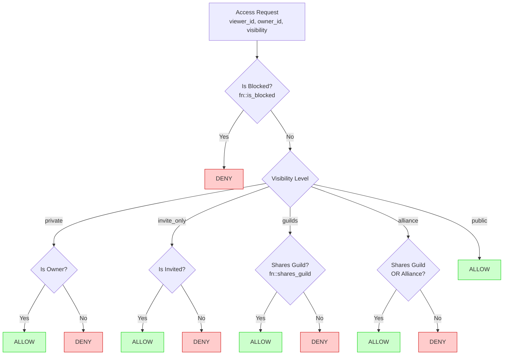

# Security Guide

This document covers access control, data privacy, and security best practices for the Saga API.

## Table of Contents

- [Access Control Model](#access-control-model)
- [Block System](#block-system)
- [Visibility Levels](#visibility-levels)
- [Location Privacy](#location-privacy)
- [Database Security Functions](#database-security-functions)
- [API Security Patterns](#api-security-patterns)
- [Security Checklist](#security-checklist)

---

## Access Control Model

Saga uses a layered access control model enforced at both database and application layers.

### Core Principles

1. **Block filtering is always checked first** - Blocked users are invisible to each other
2. **Visibility determines base access** - Each content type has a visibility setting
3. **Guild membership gates "guilds" visibility** - Only members of shared guilds can see guild-scoped content
4. **Alliance membership extends guild visibility** - Allied guilds can see "alliance" scoped content
5. **Fail-secure defaults** - When in doubt, deny access

### Access Decision Flow



---

## Block System

When a user blocks another, both users become completely invisible to each other.

### Block Tables

Two block tables exist for historical reasons:

- `block` - Current standard (uses `blocker_user_id`, `blocked_user_id`)
- `user_block` - Legacy format (uses `blocker`, `blocked`)

Both are checked for completeness.

### Block Check Function

```sql
-- Database function to check bidirectional blocks
DEFINE FUNCTION fn::is_blocked($user_a: string, $user_b: string) {
    LET $count = SELECT count() FROM block
        WHERE (blocker_user_id = type::record("user", $user_a)
               AND blocked_user_id = type::record("user", $user_b))
           OR (blocker_user_id = type::record("user", $user_b)
               AND blocked_user_id = type::record("user", $user_a))
        GROUP ALL;
    RETURN ($count[0].count ?? 0) > 0;
};
```

### Application Layer Integration

```go
// In discovery service
func (s *DiscoveryService) isBlocked(ctx context.Context, userID1, userID2 string) bool {
    if s.moderationRepo == nil {
        return false
    }
    blocked, err := s.moderationRepo.IsBlockedEitherWay(ctx, userID1, userID2)
    if err != nil {
        return false // Fail open to avoid breaking discovery
    }
    return blocked
}

// Usage in discovery results
for _, candidate := range candidates {
    if s.isBlocked(ctx, requesterID, candidate.UserID) {
        continue // Skip blocked users
    }
    // ... process candidate
}
```

### Self-Block Prevention

```sql
-- Trigger prevents users from blocking themselves
DEFINE EVENT block_self_check ON TABLE block WHEN $event = "CREATE" THEN {
    IF $after.blocker_user_id = $after.blocked_user_id {
        THROW "Cannot block yourself";
    };
};
```

---

## Visibility Levels

Content visibility controls who can access resources.

| Level         | Who Can See                       | Use Case                          |
| ------------- | --------------------------------- | --------------------------------- |
| `private`     | Only the owner                    | Drafts, personal notes            |
| `invite_only` | Explicitly invited users          | Private events, exclusive content |
| `guilds`      | Members of shared guilds          | Default for most content          |
| `alliance`    | Members of guilds + allied guilds | Cross-guild collaboration         |
| `public`      | Any authenticated user            | Public events, open content       |

### Guild Membership Check

```sql
-- Check if two users share at least one guild
DEFINE FUNCTION fn::shares_guild($user_a: string, $user_b: string) {
    LET $guilds_a = SELECT out FROM responsible_for
        WHERE in IN (SELECT id FROM member WHERE user = type::record("user", $user_a));

    LET $shared = SELECT count() FROM responsible_for
        WHERE in IN (SELECT id FROM member WHERE user = type::record("user", $user_b))
        AND out IN $guilds_a.out
        GROUP ALL;

    RETURN ($shared[0].count ?? 0) > 0;
};
```

### Alliance Membership Check

```sql
-- Check if users share an alliance (their guilds are allied)
DEFINE FUNCTION fn::shares_alliance($user_a: string, $user_b: string) {
    LET $guilds_a = SELECT out FROM responsible_for
        WHERE in IN (SELECT id FROM member WHERE user = type::record("user", $user_a));

    LET $guilds_b = SELECT out FROM responsible_for
        WHERE in IN (SELECT id FROM member WHERE user = type::record("user", $user_b));

    LET $alliance_count = SELECT count() FROM guild_alliance
        WHERE status = "active"
        AND (
            (guild_a_id IN $guilds_a.out AND guild_b_id IN $guilds_b.out)
            OR (guild_b_id IN $guilds_a.out AND guild_a_id IN $guilds_b.out)
        )
        GROUP ALL;

    RETURN ($alliance_count[0].count ?? 0) > 0;
};
```

### Unified Access Check

```sql
-- Master function combining all checks
DEFINE FUNCTION fn::can_access($viewer_id: string, $owner_id: string, $visibility: string) {
    -- Step 1: Always check blocks first
    IF fn::is_blocked($viewer_id, $owner_id) THEN {
        RETURN false;
    };

    -- Step 2: Check visibility level
    IF $visibility = "public" THEN RETURN true END;
    IF $visibility = "private" THEN RETURN $viewer_id = $owner_id END;
    IF $visibility = "guilds" THEN RETURN fn::shares_guild($viewer_id, $owner_id) END;
    IF $visibility = "alliance" THEN {
        RETURN fn::shares_guild($viewer_id, $owner_id) OR fn::shares_alliance($viewer_id, $owner_id);
    };
    IF $visibility = "invite_only" THEN RETURN false END;

    RETURN false;
};
```

---

## Location Privacy

User locations are handled carefully to protect privacy.

### Location Data Model

```go
// Internal location (stored in database, never exposed directly)
type LocationInternal struct {
    Lat          float64 `json:"lat"`          // Exact latitude
    Lng          float64 `json:"lng"`          // Exact longitude
    City         string  `json:"city"`         // City name (public)
    Neighborhood string  `json:"neighborhood"` // Optional
    Country      string  `json:"country"`      // Country name (public)
    CountryCode  string  `json:"country_code"` // ISO code
}

// Public profile only shows city/country + distance bucket
type PublicProfile struct {
    City     string         `json:"city"`
    Country  string         `json:"country"`
    Distance DistanceBucket `json:"distance"` // "nearby", "2km", "5km", etc.
}
```

### Distance Buckets

Instead of exposing exact distances, we use fuzzy buckets:

```go
type DistanceBucket string

const (
    DistanceNearby  DistanceBucket = "nearby"  // < 500m
    Distance2km     DistanceBucket = "2km"     // < 2km
    Distance5km     DistanceBucket = "5km"     // < 5km
    Distance10km    DistanceBucket = "10km"    // < 10km
    Distance25km    DistanceBucket = "25km"    // < 25km
    DistanceFar     DistanceBucket = "far"     // 25km+
    DistanceUnknown DistanceBucket = "unknown"
)

func GetDistanceBucket(distanceKm float64) DistanceBucket {
    switch {
    case distanceKm < 0.5:  return DistanceNearby
    case distanceKm < 2:    return Distance2km
    case distanceKm < 5:    return Distance5km
    case distanceKm < 10:   return Distance10km
    case distanceKm < 25:   return Distance25km
    default:                return DistanceFar
    }
}
```

### Safe Profile Query

```sql
-- Get profile without exposing exact location
DEFINE FUNCTION fn::get_safe_profile($viewer_id: string, $target_id: string) {
    IF fn::is_blocked($viewer_id, $target_id) THEN RETURN NONE END;

    LET $profile = SELECT * FROM user_profile WHERE user = type::record("user", $target_id);
    IF array::len($profile) = 0 THEN RETURN NONE END;

    LET $p = $profile[0];

    IF $p.visibility = "private" THEN RETURN NONE END;
    IF $p.visibility = "guilds" AND NOT fn::shares_guild($viewer_id, $target_id) THEN {
        RETURN NONE;
    };

    -- Return safe profile (no exact coordinates)
    RETURN {
        user_id: $target_id,
        bio: $p.bio,
        tagline: $p.tagline,
        languages: $p.languages,
        city: $p.location.city,        -- Only city
        country: $p.location.country,  -- Only country
        visibility: $p.visibility,
        last_active: $p.last_active
    };
};
```

---

## Database Security Functions

### Summary of Security Functions

| Function                | Purpose                          | Used By                        |
| ----------------------- | -------------------------------- | ------------------------------ |
| `fn::is_blocked`        | Check bidirectional block status | Discovery, Profiles, Messaging |
| `fn::is_guild_member`   | Check single guild membership    | Guild access                   |
| `fn::shares_guild`      | Check if users share any guild   | Visibility enforcement         |
| `fn::shares_alliance`   | Check if users share an alliance | Extended visibility            |
| `fn::can_view_guild`    | Check guild visibility access    | Guild viewing                  |
| `fn::can_access`        | Master access control function   | All content types              |
| `fn::get_safe_profile`  | Get privacy-respecting profile   | Profile viewing                |
| `fn::get_blocked_users` | Get all blocked user IDs         | Batch filtering                |

---

## API Security Patterns

### Authentication Required

All API endpoints require authentication except:

- `POST /v1/auth/register`
- `POST /v1/auth/login`
- `POST /v1/auth/refresh`
- `GET /v1/health`

### Authorization Middleware

```go
// Extract and validate user from JWT
func GetUserID(ctx context.Context) string {
    claims, ok := ctx.Value(UserClaimsKey).(*JWTClaims)
    if !ok || claims == nil {
        return ""
    }
    return claims.UserID
}

// Handler pattern
func (h *Handler) SomeEndpoint(w http.ResponseWriter, r *http.Request) {
    userID := middleware.GetUserID(r.Context())
    if userID == "" {
        WriteError(w, model.NewUnauthorizedError("authentication required"))
        return
    }
    // ... handler logic
}
```

### Resource-Level Authorization

For resources with visibility controls:

```go
// Profile viewing with all security checks
func (s *ProfileService) GetPublicProfile(ctx context.Context, viewerID, targetUserID string) (*PublicProfile, error) {
    // 1. Check blocks first
    if s.isBlocked(ctx, viewerID, targetUserID) {
        return nil, ErrProfileNotFound
    }

    // 2. Get profile
    profile, err := s.profileRepo.GetByUserID(ctx, targetUserID)
    if err != nil || profile == nil {
        return nil, ErrProfileNotFound
    }

    // 3. Check visibility
    if profile.Visibility == VisibilityPrivate {
        return nil, ErrProfileNotFound
    }

    // 4. Check guild membership for "guilds" visibility
    if profile.Visibility == VisibilityGuilds {
        if !s.sharesGuild(ctx, viewerID, targetUserID) {
            return nil, ErrProfileNotFound
        }
    }

    // 5. Return safe profile (no exact location)
    return profile.ToPublic(), nil
}
```

---

## Security Checklist

### For New Features

- [ ] Block filtering added to all user-facing queries
- [ ] Visibility checks enforced for the content type
- [ ] Guild membership validated for "guilds" visibility
- [ ] Location data never directly exposed (use buckets)
- [ ] Input validation on all user-provided data
- [ ] SQL injection prevented (parameterized queries)
- [ ] Rate limiting applied to sensitive endpoints

### For Discovery/Search Endpoints

- [ ] Blocked users excluded from results
- [ ] Results respect visibility settings
- [ ] Pagination implemented (prevent data dumping)
- [ ] Results limited to reasonable maximum

### For Data Mutations

- [ ] User owns or has permission to modify resource
- [ ] Self-action prevention where appropriate (self-block, self-report)
- [ ] Cascade effects considered (what happens when parent deleted?)

### For Profile/Personal Data

- [ ] Never expose exact coordinates
- [ ] Use distance buckets instead of exact distances
- [ ] Respect visibility settings
- [ ] Allow users to control what's shared

---

## Related Documentation

- [ARCHITECTURE.md](./ARCHITECTURE.md) - System overview
- [DATABASE.md](./DATABASE.md) - Database layer details
- [SCHEMA.md](./SCHEMA.md) - Complete schema reference
- [PERFORMANCE.md](./PERFORMANCE.md) - Performance considerations
